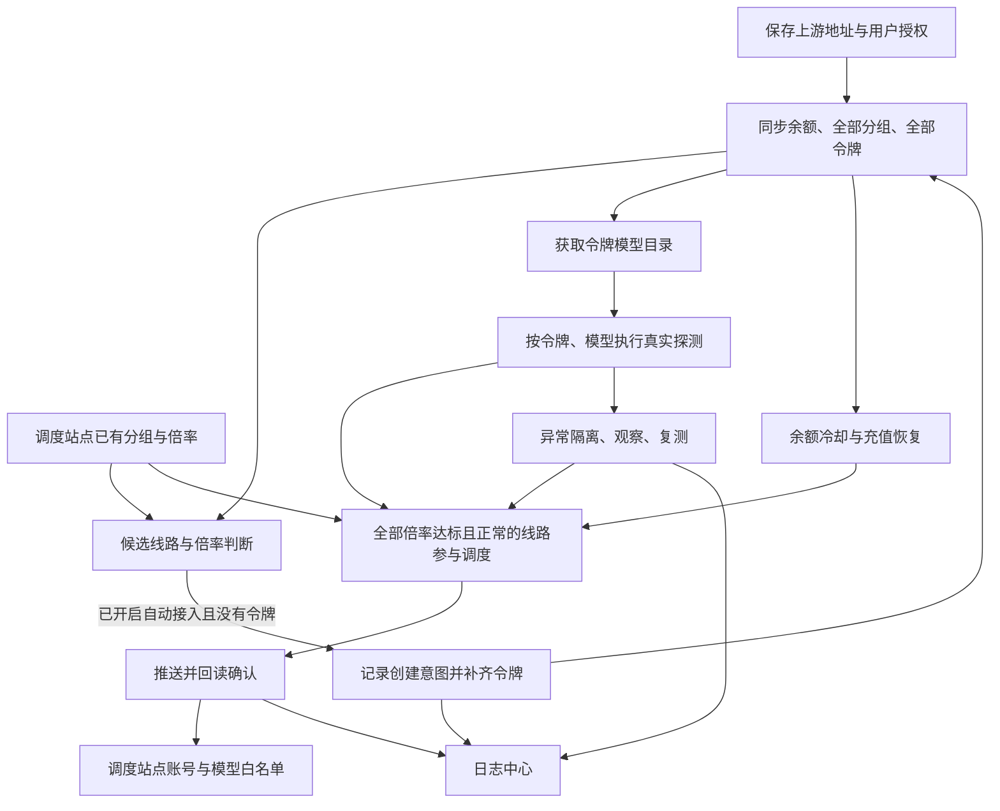

# 项目全面梳理与操作简化

审查与实施日期：2026-09-21。

本文区分已实现的整合、保留的必要操作和后续改进空间。审查覆盖上游接入、授权、余额、分组、令牌、模型探测、调度、充值、日志、存储、导航和部署。项目继续使用现有 React、原生 CSS、Node.js 与 SQLite，没有引入新框架或业务依赖。

## 一、当前项目应该怎样使用

日常路径应当是：**配置调度站点，添加上游，随后查看自动结果与需要处理的异常。**

- 添加上游时，“自动探测新令牌”默认开启。后台读取账户余额、全部可用分组与令牌。
- 对于还没有令牌的分组，后台检查已开启自动调度的目标站点。名称/平台/等级匹配、计费方式可判断、折算倍率达标时，自动补齐缺失令牌。
- 令牌同步后自动获取模型目录，并按已有探测策略验证每个模型。
- 调度按模型系列匹配分组，每个调度站点、分组、模型选择一条稳定主用。其他合适线路继续作为备用探测。
- 单个模型异常按模型隔离。余额不足、凭据失效等账户或令牌级问题按相应范围暂停。复测满足恢复条件后自动恢复。
- 人工主要处理授权失效、人机验证、多目标歧义、充值、外部写入结果不明确等问题。

“自动”不代表擅自覆盖已有设置。老渠道仍沿用原来的自动接入开关；已有手动停用令牌不会因为这次更新而启用。已有调度站点的自动推送开关不变，已关联的调度账号按最新要求统一自动管理，见第十二节。

### 正常接入所需操作

| 场景 | 操作 |
| --- | --- |
| 首次配置调度站点 | 填写站点地址和 Admin API Key，保存；新站点默认勾选自动推送，可取消 |
| 添加新上游 | 填写上游地址、凭据、充值倍率，保存；默认自动探测新令牌 |
| 查看是否已推送 | 进入“线路管理 → 自动调度”，默认有参与调度的线路时突出这些线路 |
| 查看具体模型、令牌的探测 | 进入“探针监控”，或从上游行直接跳转本站探针 |
| 查看停用或切换原因 | 展开线路模型详情，或进入该调度站点的运行日志 |
| 需要手动排查旧账号 | 线路管理中的“高级维护 → 账号关联 / 智能选线” |

满足自动接入条件后，不再要求依次点击同步令牌、拉取模型、开启新令牌、手动选线和保存关联。首次模型验证仍需要真实上游响应，不能在保存后立即显示为已通过。

## 二、审查发现的主要问题

### 1. 页面把不同层次的工作并排摆放

原来的线路管理同时展示“分组状态、账号关联、智能选线、自动调度”四个平级入口，用户容易误认为四个页面都必须操作一次。实际日常工作应集中在自动调度与分组结果；关联与扫描属于维护工具。

调度站点页面又显示一套完整分组、账号嵌套表，线路管理再显示一套分组/账号状态；自动调度下面既有日志中心链接，又有另一套自动处理记录。信息重复，但上下文不同，容易让人误以为是不同任务。

### 2. 自动流程缺少“没有令牌”的连接环节

之前，已发现令牌可以自动探测和推送，但补齐缺失令牌只发生在手动“智能选线”任务中。因此上游明明有可用分组，也可能停在“暂无令牌”，还需要人工启动扫描。

本次将补齐流程接到自动调度的后台循环，并复用手动扫描已有的候选分析和令牌创建函数。不是再写一套选线标准。

### 3. 慢站点拖住整轮自动接入

原来的账户后台循环逐站等待授权、余额和分组请求。一个慢站点会延迟后续站点，下一轮任务也会受到整轮等待影响。用户看到长时间没有更新，容易通过反复点击同步来推动进度。

现在各渠道独立执行，到下一次调度时仍可处理其他新到期渠道；同一个渠道继续通过原有队列串行处理，避免授权轮换、令牌同步和探测相互覆盖。

### 4. 查看页面也会触发额外的上游操作

打开上游详情原来会立即执行一次账户与分组同步，而后台本来就在做周期同步。频繁查看详情就会重复访问上游。

现在查看详情先展示已有快照；确需立即更新时使用详情内的刷新按钮。

### 5. 看似局部的操作实际上影响全部渠道

探针页面筛选到单个站点后，旧的“同步全部令牌”逻辑仍获取并依次同步全部上游。

现在入口会显示“同步本站令牌”，并只同步当前站点；全局视图才提供“同步全部令牌”。不同站点的手动同步可独立完成，并分别显示失败原因。

### 6. 重复实现请求与状态合并

多个页面各自拼接 GET/POST、JSON 请求体和错误处理。令牌同步中，拿到新密钥和暂时沿用旧密钥的两个分支也重复维护了探测开关、模型目录和历史字段，后续新增字段时容易漏一边。

倍率折算在手动扫描与自动推送中各写一份，虽主要公式一致，仍存在将来边界处理分叉的风险。

## 三、本次已完成的整合

| 位置 | 已完成修改 | 使用效果 |
| --- | --- | --- |
| 桌面与手机导航 | 共用同一份导航定义；删除空的“集成”入口；旧集成地址回到总览 | 菜单一致，没有无效功能入口 |
| 侧边栏 | 删除“未连接工作区”“本地开发 · 等待后端接入”等与实际运行不符的占位文案 | 不再让用户误以为部署未完成 |
| 总览 | 8 列缩为 6 列；次数与最近探测放进探测明细；授权时间和余额细节折叠 | 余额、状态和操作更容易看到，桌面减少横向拥挤 |
| 总览渠道 | 显示自动接入/手动接入；展示自动补齐令牌的错误 | 能判断渠道是否参与自动流程 |
| 上游详情 | 打开时不重复同步；保留手动刷新与完整分组倍率 | 查看不会额外触发上游操作 |
| 调度站点 | 只保留连接、自动调度状态、数量和入口 | 避免同一页重复维护分组与账号大表 |
| 分组状态 | 集中显示分组倍率、平台、启用状态；详情保留计费类型和高峰倍率 | 原有定价信息仍可查看 |
| 线路管理 | 默认入口为自动调度；分组状态为另一常用视图；账号关联与智能选线归入高级维护 | 正常使用无需逐个维护页面配置 |
| 自动调度 | 参与调度、需处理、暂停与等待、全部四类筛选；模型原因按需展开 | 默认突出参与调度的线路，暂停原因按需查看 |
| 自动调度目标 | 已确定的目标直接展示名称；歧义时才展示选择；未推送线路仍可展开更换目标 | 减少满屏不可编辑的选择框 |
| 日志 | 删除自动调度页重复事件列表，统一进入有筛选和分页的日志中心 | 同一个问题沿同一份日志追踪 |
| 探针监控 | 两个页签共用刷新和维护入口；令牌管理补齐批量启用，与批量停止对应 | 少找入口，按当前范围操作 |
| 普通业务请求 | 统一到 `requestJSON`，底层继续使用 `consoleFetch` | 版本检查、断线读取重试和错误消息保持一致 |
| 调度页自动刷新 | 修正保存设置后所有后续轮询被旧版本标记丢弃的问题 | 保存后持续读取最新状态，无需反复刷新 |
| 令牌同步 | 两个凭据分支共用探测状态合并 | 保留手动开关、模型和探测历史的规则一致 |
| 成本判定 | 扫描、推送与探测成本拦截复用 `effectiveRouteCost` | 充值倍率与高峰倍率的计算一致 |
| 后台接入 | 按渠道独立运行；自动扫描缺失且符合条件的令牌 | 减少慢站拖延和人工补齐 |
| 不确定写入 | 保留创建意图记录；后续正常同步按稳定名称回读确认 | 不盲目重复创建，确认后清除已解决错误 |
| 样式 | 清理已删除统计图、空集成、工作区占位等不再使用的规则 | 减少失效结构残留 |

列表仍统一每页 5 条。筛选针对全部结果，批量操作针对当前筛选范围，不只针对当前页。原有路由地址、查询参数、详情入口和历史仍可使用。

## 四、现有功能与数据流

### 上游渠道

- NewAPI 使用用户系统访问令牌与按版本需要填写的用户 ID；Sub2API 上游使用普通用户登录身份。
- 登录授权与管理员调度权限分开，不能用用户模型 Key 替代后台登录凭据。
- Sub2API 续期令牌由服务端保存并轮换；密码与一次性人机验证凭证不作为长期登录凭据保存。
- 充值倍率决定实际余额及成本折算。钱包余额与订阅额度不是同一个数据。
- 账户与分组失败时保留上次快照并展示错误，不伪装成最新数据。

### 探针

- 模型目录来自对应令牌的上游接口；发现模型不等于验证通过。
- 真实执行单位是“上游渠道 + 令牌 + 精确模型 ID”。不同令牌拥有独立结果。
- 正常模型每分钟探测；历史按请求发起分钟归档。没有记录与探测失败不同。
- 超时、限流、协议参数兼容、缺少有效内容和上游明确拒绝需要区别处理。
- 已隔离的托管模型每 5 分钟复测。不会因一轮未知结果直接删除完整历史。
- 余额确认为零或负数时，探测暂停；模型的实际成本高于对应调度目标倍率时暂停该范围。倍率相等允许。
- 模型列表读取失败但已有近期有效探测时，不仅凭目录接口异常把整条线路判坏。

### 自动调度

- 单向：探测站推送到 Sub2API 调度站点。没有恢复 NewAPI 主站关联或从调度站反向导入为上游的旧流程。
- 先按模型系列与协议匹配目标，再验证实际成本；成本达标后只比较稳定性，不以便宜或延迟低代替可靠性。
- 每个站点、分组、模型允许多条达标线路同时参与调度。同一个 URL/Key 可按不同模型系列推送到对应分组。
- 新账号沿用优先级 1、并发 1000 和模型白名单策略。
- 单个模型失败优先在模型范围隔离；账户余额、令牌有效性等整体条件不满足时才扩大暂停范围。
- 对已经成功过的模型，短暂网络问题仍使用现有观察期和成功证据；有正常备用时可以切换。
- 远端写入必须确认。探测或倍率在等待远端请求时发生变化，会重新计算计划，不继续执行过时决定。
- 已关联账号统一自动管理；移除手动接管模式，关闭探针后自动退出调度。

### 充值与余额公告

- 低余额公告使用折算后的余额阈值，保留充值/兑换入口。
- 充值付款、兑换码消耗仍由人工发起；系统不自动花钱。
- 创建订单与完成到账是不同状态。请求超时不能通过重复 POST 猜测是否成功。
- 公告和渠道表调用同一充值对话框，避免两套支付行为。

### 日志

- 记录调度决策、写入确认、模型变化、同步、授权、充值和人工操作。
- 日志中心保留按站点、上游、结果、类型、时间及关键字筛选。
- 正常且无变化的重复核对不应生成一堆相同操作日志。
- 探针历史与操作日志各保留自己的粒度；不应把每分钟所有健康结果复制成同一套操作记录。

## 五、自动补齐令牌的边界

自动补齐必须同时满足：

1. 上游渠道开启“自动探测新令牌”。
2. 至少一个目标调度站点已开启自动推送，目标分组当前启用，倍率快照有效。
3. 上游授权与余额可确认，余额大于零。
4. 上游分组与令牌目录成功完整同步，且快照未过期。
5. 模型系列/平台/名称及等级满足现有匹配规则。
6. 计费模式与基础倍率可判断，折算成本不高于调度分组倍率。
7. 此上游分组没有现有令牌。

成本公式：`上游适用倍率 × max(1, 高峰因子) ÷ 充值倍率`。

已有令牌只是停用、额度耗尽或不可用时，不自动造一个新令牌替代它。多调度站点匹配同一上游分组时，创建流程仍由同一渠道队列和创建意图记录防重。

远端返回失败或连接中断时，先检查是否已创建成功；无法确认的意图继续保留，不在下一轮无条件重复 POST。稍后的正常同步若发现原稳定名称对应令牌，会回读确认并继续接入。

## 六、哪些人工操作仍有必要

| 情况 | 保留人工操作的原因 |
| --- | --- |
| 登录过期、凭据被撤销 | 无法替用户猜测新密码或授权 |
| 人机验证、两步验证 | 需用户正常完成上游验证，系统不能伪造验证结果 |
| 目标分组有多个同等候选 | 不能仅凭名称猜测业务等级；明确一次目标后沿用配置 |
| 倍率或计费方式不明确 | 订阅、自动选组、图片视频独立计费不能当成已确认成本 |
| 已关闭的令牌探针 | 保留探针关闭设置；调度账号统一自动管理 |
| 创建、推送结果不明确 | 应先回读，必要时核对远端，不能重复创建 |
| 付款、兑换码 | 涉及实际资金和一次性消耗，需要用户明确发起 |

这些是业务决策与权限边界，不是遗漏的自动化步骤。

## 七、重复代码怎样整合，哪些不应硬合并

### 已合并的共同能力

- 导航：`src/route-navigation.js` 同时供桌面与手机使用。
- 业务请求：`src/console-fetch.js` 负责构建版本检查、只重试读取、统一 JSON 与错误处理；保留错误码供充值流程处理。
- 分页：继续复用 `pagination.jsx` / `pagination-data.js`，每页 5 条。
- 展示缓存：继续复用 `view-cache.js`，按登录用户与构建版本隔离，不缓存密码、API Key、支付响应。
- 成本：`server/user-groups.js` 的 `effectiveRouteCost` 由手动扫描和自动推送共用，探测成本拦截沿用同一自动调度目标判断。
- 令牌创建：自动与手动扫描共用候选分析和 `provisionRouteToken`，保留写前意图与回读确认。
- 令牌状态：凭据刷新成功和暂用旧凭据复用同一份探测状态合并。

### 有相似外形但刻意保留的分离

- 登录请求有独立超时、会话验证与退出清理，不能把它简单当成普通列表请求。
- 探针读取有 ETag、5 秒显示刷新和操作后读写竞争处理；日志有固定快照翻页；任务有运行状态轮询。它们不应被一个包含大量开关的通用 Hook 强行统一。
- 模型展示分类可以面向用户合并系列；调度匹配必须同时考虑精确模型 ID、调用协议、分组等级和人工目标。不能用 UI 分类函数直接替代调度判定。
- 渠道行的“整体状态”是摘要；每个模型/令牌的状态才是探针事实；调度状态还包括远端白名单与人工管理。这些层次不是同一状态的重复副本。

## 八、存储与性能现状

业务持久化使用服务端 SQLite，并对敏感业务记录及探测历史加密。内存保存运行中的工作状态；浏览器 IndexedDB 只是已脱敏的展示快照，不是业务事实来源。

继续运行一个 API/调度服务进程。同进程内的渠道网络请求可以并发，不等于开启多个共享业务状态的服务进程。把授权循环改成独立渠道任务，不需要改变数据库架构。

本次的实际性能改善点是消除跨站串行等待、避免查看详情重复同步、减少同页重复表格和重复入口。自动扫描基于已有快照，只有发现符合条件的缺失令牌才执行远端创建流程。

本地测试已覆盖一个慢站点和另外 100 个独立渠道，验证其他渠道及后续调度周期可以继续同步。这证明队列隔离行为正确，**不代表已在生产环境完成 100 个真实上游的长期负载测试**。真实容量还取决于每站令牌数、模型数、响应时长及服务器资源。

## 九、验证与发布记录

测试全部使用临时存储或本机模拟 HTTP 上游，没有开启本地真实渠道探测，也未把本地业务数据上传服务器。

验证包括：

- 自动补齐符合条件的令牌、倍率相等、超过倍率不创建、不同系列不创建。
- 自动开关关闭、余额不足、已有停用令牌、过期倍率快照时不创建。
- 多调度站点和并发调度不会重复创建；不确定写入不盲目重试；后续回读成功后继续接入。
- 100 个快站点不会被一个慢站点阻塞；新加入的渠道无需等待上一轮全部完成。
- 手动停用、重新授权、重启后探测开关与历史保留。
- 各页面分页、批量启停范围、过滤、展开状态、历史焦点恢复。
- 手机 320 / 390 像素和桌面布局、导航、对话框与操作可达性。
- 充值错误码、不重复提交、日志、缓存、登录与构建版本处理。

完整后端及共享请求回归 147 项通过；页面回归覆盖导航、分页、调度、选线、探针、充值、公告、日志、缓存和手机布局。曾发现测试固定端口相互占用，相关测试已改为系统分配临时端口并重跑通过。

发布使用 `deploy/build-release.mjs` 的干净构建目录与文件白名单。服务器激活脚本备份业务数据并校验记录与历史，保留旧静态资源，出现启动失败可回滚。

### 本次实际发布结果

- 已发布至 `https://38.92.15.50/`，版本目录为 `/opt/signal-monitor/releases/20260921-111929-fixes`。
- 构建标识：`a823ce72-f3ba-46fc-8713-bf3246cf79da`。
- 发布前备份：`/var/backups/signal-monitor/20260921-111929/data.tar.gz`。
- 部署脚本已校验原有业务记录、探测历史与存储密钥得到保留；发布前后手动停用状态摘要一致。
- 线上 8 个页面完成桌面、390 像素与 320 像素手机宽度检查，未发现页面运行异常、静态资源错误或水平溢出。
- 线上业务服务正常运行；本地真实探测保持停止。

以上是本次发布与检查时的结果，不替代上线后的持续运行观测。

## 十、仍值得后续处理的技术债

1. `main.jsx` 仍包含总览、上游编辑器与令牌表等较多 JSX，部分代码较紧凑。此次已抽出共同请求与导航，没有为了拆文件而把所有业务重写。下一次修改某个模块时可将其整体迁到独立文件。
2. CSS 历史追加较多。本次只清理确认无入口的样式；后续宜逐个页面合并样式优先级，避免全局一次性重排引入手机回归。
3. 多数业务仍以完整快照接口给前端。现有 ETag、快照缓存与每页 5 条降低了页面压力，但大规模模型历史下仍应实测响应体大小和内存，再决定服务器端分页。
4. 调度站点导出账号凭据的流程有权限与站点版本差异，仍可能出现需要人工修复的账号。不能用自动接管掩盖权限失败。
5. 未确认的倍率和分组歧义是剩余人工工作的主要来源。适合后续增加明确的持久化映射规则，而不是用更宽松的猜测提高“自动化比例”。

本次没有声称重复代码全部消失，也没有用自动化覆盖需要人工确认的业务状态。已解决的是实际重复的日常流程、显示结构与共享规则，使用户主要查看结果、处理异常。

## 十一、后续调整：取消唯一主用策略

根据最新要求，已删除模型稳定性排名、主用互斥和转为备用的执行逻辑。后台现在推送全部倍率达标且探测正常的线路，旧策略暂停的健康备用账号自动恢复。人工停止、故障恢复、余额与倍率限制、同源去重和未确认写入保护继续保留。

验证与部署：149 项后端及共享请求测试通过，自动调度、调度站点、智能选线和整合流程的桌面与手机测试通过。新版本发布至 `/opt/signal-monitor/releases/20260921-121327-fixes`，发布前备份位于 `/var/backups/signal-monitor/20260921-121327/data.tar.gz`。

上线核对时，参与调度的系统管理账号从 16 个增加到 27 个，56 个分组内模型已有多条线路；旧策略的备用暂停记录已清零。手动停止设置摘要保持一致，业务数据、历史和存储密钥校验通过。以上为核对时快照，数量会随实时探测结果变化。

线上构建 `5cb0ebe2-a871-4b97-bbde-d30f062039e8` 已完成自动调度、调度站点和智能选线 3 个页面的桌面、390 / 320 像素验证，页面运行错误与静态资源错误均为 0；公网首页、脚本、样式和版本接口检查通过。

## 十二、取消线路手动管理

按最新要求，删除逐线路接管开关以及远端开关变化触发的永久手动保护，历史账号与停止接管记录自动迁移。所有与探测源 URL / Key、平台、分组匹配的账号均由后台自动管理，既有停用或 inactive 账号在两轮新验证通过后恢复，无需逐条点击。

远端开关和模型名单由探测结果持续维护；未知凭据、分组不匹配、倍率、余额、到期或冷却限制仍生效。凭据重新匹配后自动核对。保留站点总开关、各令牌探针开关、业务记录和探测历史，本地真实探测保持停止。

验证与发布结果：152 项后端及共享请求测试通过，自动调度与调度站点页面测试通过。已部署至 `/opt/signal-monitor/releases/20260921-125949-fixes`，构建标识 `05332628-1416-4abf-985f-059713d34d0e`，发布前备份为 `/var/backups/signal-monitor/20260921-125949/data.tar.gz`。发布过程校验业务记录、历史、关联关系及存储密钥；未上传本地业务数据。

2026 年 9 月 21 日 21:07（北京时间）线上核对：12 条旧手动管理记录已全部迁移，59 条已关联账号均由自动调度管理，无待迁移记录或推送错误。Plus 分组中，老莫、Reverse API、Anc1ent API 已通过恢复验证并重新开启，参与调度账号从部署前的 6 条增加到 9 条。DragonAPI 余额不足、byecore Pro 的 0.14× 成本高于目标 0.13×、Loomex 缺少近期成功探测，因此继续暂停；未关联探测源的历史账号没有被擅自开启。数量为核对时快照，后续随实际探测结果变化。

自动调度、调度站点、智能选线 3 个线上页面通过桌面及 390 / 320 像素手机检查，无页面运行错误、资源错误或水平溢出。公网首页、脚本、样式与版本接口均正常，服务重启计数为 0；部署前后令牌停用设置摘要一致，本地真实探测保持停止。
