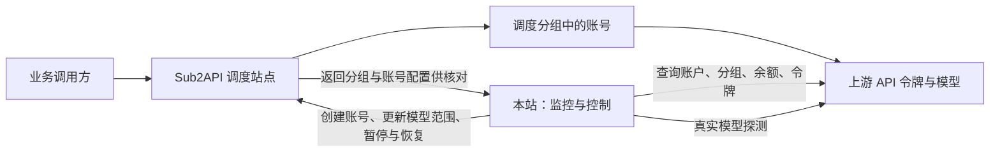

# 当前项目全部功能与运行逻辑

2026-09-21 操作简化与重复逻辑整合说明见 [项目全面梳理与操作简化](project-consolidation-2026-09-21.zh-CN.md)。

整理日期：2026-09-20。核对依据：当前 `src/`、`server/`、`deploy/` 实现。

本文是当前功能说明，不是未来开发方案。站点、令牌、账号数量随线上运行变化，本文不把某次历史验收数量当作当前实时数量。整理过程不修改业务配置、不启用探测、不操作远端账号。

## 1. 项目现在负责什么

本项目是一个**上游账户管理、模型探测和 Sub2API 调度控制台**。

它从已经接入的上游账户获取分组、倍率和令牌，对每个令牌的模型进行真实请求验证，再把可用模型推送到我们管理的 Sub2API 调度站点。出现故障时缩小模型范围，必要时暂停整条线路；符合恢复条件后重新开放。

当前有两条不同的路径：



- **业务流量**由 Sub2API 调度站点转发，不经过监控站转发。
- **线路来源**是本站接入的上游渠道及令牌；调度站点账号用于核对推送目标，不反向导入为上游渠道。
- 原来的 NewAPI 主站管理已移除。NewAPI 仍支持作为第三方上游接入。
- 可选的 NewAPI 用户网关单独探测终端入口，不参与调度选线和定价编辑。上游直连探针和用户网关探针是两条结果，不能混成同一条健康状态。

监控服务停止时，调度站仍按远端已保存的配置工作；监控站此时不能继续更新白名单或暂停新出现的故障。这不是一个随每次用户请求实时参与决策的代理服务。

## 2. 对象、名称与权限

### 2.1 各种“站点”“线路”的准确含义

| 对象 | 在项目中的含义 | 唯一识别方式 |
| --- | --- | --- |
| 上游渠道 | 一个已接入的上游账户连接，包括站点地址、授权和充值倍率 | 本站渠道 ID |
| 上游分组 | 该账户能选择的一种服务线路或计费组 | 渠道 ID + 上游分组 ID |
| 上游令牌 | 上游创建的、用于调用模型的 API Key | 渠道 ID + 令牌 ID |
| 模型目录 | 使用某把 Key 从上游读取的模型名称列表 | 渠道 ID + 令牌 ID + 模型名 |
| 模型探测 | 某把 Key 对某个模型的一次真实调用 | 上述组合 + 时间/记录序号 |
| 调度站点 | 我们拥有管理权限的 Sub2API 站点 | 本站调度站点 ID |
| 调度分组 | 调度站对外提供的分组，含平台、倍率和账号归属 | 调度站点 ID + 分组 ID |
| 调度账号 | 调度站用来访问上游的资源；自动推送主要管理 `apikey` 类型 | 调度站点 ID + 账号 ID |
| 自动推送线路 | 某个上游令牌在某个平台类型下的推送单元 | 渠道 ID + 令牌 ID + 平台类型 |
| 账号关联 | 调度账号与上游令牌、模型映射之间的对应关系 | 账号 ID 与来源 ID、配置指纹 |

因此，“一个站点”“一个分组”“一把令牌”“一条推送线路”不是相同数量。一把令牌同时支持 OpenAI 和 Anthropic 接口时，可以形成不同平台的推送线路。

同名渠道、同名令牌、相同 Endpoint 都不会自动合并成一份探测结果。

### 2.2 四类凭据分别做什么

| 凭据 | 获取的权限 | 不应混用的场景 |
| --- | --- | --- |
| 监控站登录账号/密码 | 访问本控制台与数据接口 | 不是上游登录凭据 |
| NewAPI 系统访问令牌及所属用户 ID | 查询该上游账户、余额、分组及模型调用令牌 | 不是模型调用 Key，也不默认拥有管理员权限 |
| Sub2API 普通用户登录授权 | 查询该上游账户可用资源 | 不要求上游管理员权限 |
| 调度站 Sub2API Admin API Key | 读取并管理我们的调度站账号和分组快照 | 只发送到该调度站的管理接口 |

真实探测使用同步得到的**模型调用 API Key**。获取余额成功和模型调用成功，是两个独立结果。

### 2.3 当前线路命名

统一显示为：`站点名称 · 实际倍率`，例如 `示例站点 · 0.12×`。

- 实际倍率来自该令牌绑定分组的适用倍率，再除以充值倍率。
- 存在高峰倍率时显示折算范围；倍率缺失或自动分组无法固定时显示“倍率未知”。
- 同站同倍率允许同名，详情用账号 ID、令牌 ID、分组区分。
- 上游原令牌名称仍作为元数据保留；本站没有因此修改上游服务商的原 Key 名称。
- 已接管调度账号的名称可随站点名、倍率变化自动更新；匹配探测来源的账号统一自动管理。

## 3. 当前页面与功能入口

| 页面 | 已实现的功能 | 主要改变哪些数据 |
| --- | --- | --- |
| 总览 | 添加/编辑上游、重新授权、账户余额、探测汇总、查询分组与令牌、充值兑换、进入该站点探针 | 本站上游配置；授权及充值操作会调用上游 |
| 调度站点 | 添加/编辑管理员连接，同步全站分组和账号，查看分组倍率、高峰规则及账号归属 | 本站调度站连接与快照 |
| 线路管理 → 分组状态 | 按目标分组查看可用模型、关联账号、具体线路与不可用原因 | 展示与筛选 |
| 线路管理 → 账号关联 | 自动匹配、手动关联、模型映射确认、解除/恢复自动关联 | 本站关联配置 |
| 线路管理 → 智能选线 | 扫描全部账户可访问分组、名称识别、成本比较、按需补齐令牌 | 扫描结果；启用补齐时会在上游创建 Key |
| 线路管理 → 自动调度 | 自动推送开关、目标分组选择、白名单更新、停调恢复、操作记录 | 本站接管状态与远端调度账号配置 |
| 探针监控 → 模型状态 | 模型分类、逐令牌时间轴、可用性筛选、失败原因、重新验证、批量启停 | 本站探测开关和验证状态 |
| 探针监控 → 令牌管理 | 按 Endpoint 折叠令牌、展示模型目录、启停探测、同步令牌、搜索及批量停止 | 本站令牌快照和探测配置 |
| 设置 | 全局低余额提醒阈值 | 服务端控制台设置 |
| 页面顶部余额公告 | 静态展示低余额/余额待确认站点、自动换行、展开列表、进入充值兑换 | 展示；用户确认充值后调用上游 |
| 日志中心 | 调度、同步、探测、充值和人工操作记录 | 操作日志长期保存，模型探测使用现有历史 |
| 旧集成地址 | 已移除空入口，旧地址返回总览 | 无新增业务操作 |

“工作区切换”“本地开发 · 等待后端接入”等侧栏文字仍有静态占位内容，不能据此判断生产后端是否运行。设置页目前只有余额阈值，不能在界面中调整所有探针间隔或通知策略。

### 3.1 页面定位与移动端

- 使用 URL 的 hash 保存页面位置，刷新不会默认退回总览。
- 全站可分页列表统一每页 5 条，使用同一套总数、页码、上一页/下一页控件；超过 5 页时保留首页、末页和当前附近页码。搜索和状态筛选先作用于全部渠道，再排序、分页。
- 总览排序支持添加时间、名称、实际余额、成功率、异常优先和最近探测。余额使用按充值倍率折算的美元金额，未知或无法换算的金额排在最后；缺少成功率或探测时间的项目也排在最后。
- 总览页码、排序和筛选保存在 URL 参数中，刷新浏览器保留；后台 30 秒刷新不会重置当前页。搜索/筛选/排序改变后回到第一页；数据减少导致页码越界时回到最后一个有效页面。总览只在手动翻页时定位到列表顶部。
- 探针类别、模型、令牌、Endpoint、调度站点分组与账号、智能选线、自动调度和日志均分页；详情内长列表独立分页。批量操作、总数和搜索仍覆盖全部筛选结果，模型映射选择跨页保留。
- 60 分钟探测时间轴保持连续，分钟历史表每页 5 条，点击时间轴直接定位到该分钟所在页。余额公告静态展示并自动换行，展开后的提醒清单分页。
- 线路管理可带调度站点与分组参数。
- 总览单个渠道的“查看探针”进入 `#probes?channel=渠道ID`，精确过滤该渠道的模型、令牌和接入状态。
- 切换到令牌管理、刷新、浏览器后退时保留渠道条件；“查看全部站点”清除条件。
- 探针页手动搜索、模型家族与当前状态筛选，可在站点范围内继续缩小结果。
- 桌面使用侧栏，手机使用底部导航及展开菜单；表格、详情弹窗和时间轴已有移动端布局。

当前站点定位约束显示及基于显示列表的批量探测操作；“同步全部令牌”仍明确执行全部上游同步，不因进入某个站点视图改成单站同步。

## 4. 上游接入、编辑与登录续期

### 4.1 NewAPI 上游

填写名称、Endpoint、充值倍率、系统访问令牌，必要时补充令牌所属用户 ID。

服务端主要读取：

| 用途 | 上游接口 |
| --- | --- |
| 用户身份、剩余额度 | `GET /api/user/self` |
| 金额换算设置 | `GET /api/status`，不携带账户令牌 |
| 当前账户可选分组及适用倍率 | `GET /api/user/self/groups` |
| 令牌列表 | `GET /api/token/`，逐页读取 |
| 单个模型调用 Key 完整内容 | `POST /api/token/:id/key` |

当前分组倍率采用上游为该账户返回的适用值，包含该接口提供的账户特殊倍率；本站不再读取 NewAPI 主站管理员的系统定价配置。

### 4.2 Sub2API 上游

通过普通用户邮箱和密码调用 `/api/v1/auth/login`。需要两步验证时再调用 `/api/v1/auth/login/2fa`。

登录完成后保存访问令牌、刷新令牌、过期与续期时间；**不保存用户密码、六位验证码或 Turnstile 凭证**。页面可显示/隐藏这些输入字段。

Turnstile 凭证只转交给上游正常校验一次，不参与续期。界面提供 `window.turnstile?.getResponse?.()` 获取提示；能否取得有效值取决于上游页面是否提供该对象以及是否已经正常完成验证。本站不生成或绕过人机验证。

后续通过 `/api/v1/auth/me` 校验身份和查询余额，通过 `/api/v1/auth/refresh` 续期。续期一般安排在到期前，提前量取 60 秒与有效期一半中的较小值；身份检查遇到允许续期的 401 时也可尝试刷新一次。

上游撤销授权、封禁账户、刷新令牌失效等情况仍需要重新授权。当前机制是持续保存并按上游规则续期，不是永久登录保证，也不是依赖复制浏览器 Cookie。

### 4.3 编辑和重新授权的区别

- 编辑可修改名称、充值倍率、NewAPI 用户 ID，以及用于重新登录的邮箱/密码或系统访问令牌。
- 编辑时凭据留空保留当前授权；修改 Sub2API 邮箱需要同时填写密码。
- 在本站填写“新密码”是用该密码重新登录上游，**不会替用户修改上游账户的登录密码**。
- 已有上游渠道的类型和 Endpoint 在当前编辑流程中保持固定，避免把原令牌和历史混到另一站点。
- 保存前进行参数验证；登录或持久化失败时保留原配置。
- 可以先保存未授权的渠道地址，但余额、分组和令牌随后需要有效授权才能获取。

## 5. 余额、充值倍率和公告

### 5.1 余额的计算

```text
实际余额 = 上游返回的余额 ÷ 本站配置的充值倍率
```

示例：上游钱包显示 100 美元，充值倍率为 10，则本站显示折算余额 10 美元。这是按填写倍率估算的资金成本，不是根据实际充值订单建立的财务账本。

- Sub2API 使用账户钱包余额，不把订阅套餐额度合并进钱包。
- NewAPI 使用当前 `quota` 作为剩余额度，不再次扣减 `used_quota`。
- NewAPI 根据 `quota_per_unit`、币种与汇率设置换算金额；缺少换算资料时显示原始额度，不假造美元余额。
- 普通金额显示两位小数；原始额度有单独的展示精度。
- 充值倍率只影响折算展示和成本比较，不更改上游钱包，也不再次乘入充值订单的付款金额。
- 查询失败保留上次值，同时标记失败或待确认，不把失败当成余额归零。

### 5.2 更新与提醒

余额正常情况下约每 5 分钟检查，Sub2API 续期需要时可能提前。失败后退避重试；总览每 30 秒读取本站已有结果，这两种刷新不是同一动作。

总览显示余额更新时间和预计下次查询时间；繁忙、未授权或存储失败时可能没有可预计时间。

低余额公告使用**折算后的美元余额**，默认阈值为 5 美元，可以在设置中修改。余额不高于阈值时提醒；金额未知、换算缺失或超过 15 分钟未更新时给出待确认提示。旧低余额仍会保留并标记需要复核。

**公告阈值不是停调阈值。**例如提醒阈值为 5 美元，余额 4 美元只会触发提醒；当前余额阻断条件是查询成功且余额不大于 0。

## 6. 充值、兑换码与购买入口

入口位于渠道余额区域和低余额公告的展开列表。

### 6.1 兑换

1. 读取当前上游账户及充值配置。
2. 用户填写兑换码并确认提交。
3. Sub2API 调用 `/api/v1/redeem`；NewAPI 调用 `/api/user/topup`。
4. 保存本次操作标识、兑换码指纹和处理结果，不保存兑换码原文。
5. 兑换后重新检查账户余额；兑换为订阅或并发额度时也显示对应结果。

结果可能为成功、被明确拒绝、结果未知。请求超时不表示兑换失败；系统保留同一提交记录，不自动重新兑换。

### 6.2 在线充值

```text
读取支付方式 → 输入金额 → 核算金额 → 用户确认创建订单
→ 在上游收银台或二维码完成付款 → 查询订单与余额
```

- 根据上游返回的支付方式、最低/最高金额、币种精度和手续费核算。
- 报价在本站进程内保留约 5 分钟，创建订单前再次核对；价格或账户变更时要求重新核算。
- 显示支付链接、二维码和订单状态；创建订单成功不等于付款到账。
- 只有上游当前接口和本站已适配的支付方式可以在这里使用，不是完整复制每个上游的所有支付功能。
- 不自动支付，不在本站代收款。到账依赖上游支付流程。

### 6.3 不支持在线充值时

- NewAPI 从充值配置读取 `topup_link`。
- Sub2API 从公开设置中的购买入口和相关自定义菜单读取地址。
- 只展示上游明确提供的地址；读取不到时提供前往上游的入口，不猜测卡密购买网站。
- 某些入口是充值页或订阅页，不保证都是兑换码商店。

充值之后，余额检查与探测恢复是后续流程；点击付款链接、生成订单都不会直接解除调度保护。

## 7. 上游分组和 API 令牌同步

### 7.1 分组与倍率

Sub2API 读取 `/api/v1/groups/available` 和 `/api/v1/groups/rates`，整合默认倍率、用户专属倍率、平台、计费类型和高峰配置。

```text
适用倍率 = 用户专属倍率（如果设置）
         否则使用分组默认倍率
```

专属倍率 0 是有效配置，不按“未设置”处理。

NewAPI 读取当前用户可用分组；固定分组返回适用倍率，`auto` 自动分组可能无法提供固定倍率。

渠道详情展示所有**当前账户有权限访问**的分组，区分已创建令牌和未创建令牌。它不能读取该普通用户无权访问的隐藏分组。

### 7.2 令牌同步和自动进入探针

- Sub2API 读取当前用户的 `/api/v1/keys`；NewAPI 读取令牌列表及单 Key 内容。
- 完整读取分页，检查页数、总数、重复项；目前单账户最多读取 10,000 个 Key，超出或数据不完整时报错。
- 普通令牌列表只展示 ID、名称、分组、启用状态和使用时间等脱敏信息。
- 有效、未过期、能获取完整 Key 的令牌进入服务端探针配置，自动携带对应 Endpoint。
- 新建渠道默认勾选“自动探测新令牌”，也可取消；此设置可以在编辑渠道中调整。开启后，新同步的有效完整 Key 自动进入分钟探测，模型目录、余额和倍率检查仍按原有规则执行，符合推荐条件才推送。旧渠道不自动改变此设置或已有开关。
- 手动关闭的令牌保留关闭状态，即使暂时从上游列表消失、重新出现或服务重启也不会被当成新令牌自动打开。自动模式关闭只影响以后发现的令牌，不修改已有令牌。
- 余额不足时自动探测意图保留，但不发送付费请求；充值后恢复。手动点击启用时仍会提示当前余额不足。重新授权保留探测历史、预约和关闭偏好，原 Key 在新授权完成同步校验前暂停使用。
- 同步原令牌时保留其探测开关、模型状态和历史；完整 Key 本次无法读取时保留可追溯的旧数据并标记待同步。
- 完整列表确认 Key 已删除、停用或过期时，该 Key 不再作为正常可探测来源。

**同步频率：**后台初次自动发现分组与 Key，成功后约每 5 分钟重新读取，失败按至少 1 分钟间隔重试。手动点击详情刷新、同步令牌、智能选线时也会主动读取；仅打开详情不会重复同步。后台各渠道独立执行，同一渠道的同步和探测共用队列，实际执行时间受该上游响应和队列影响。

## 8. 模型目录与真实探测

### 8.1 先取目录，再逐模型验证

使用每把模型调用 Key 拉取 `/v1/models`，保留完整模型名并校验分页。每把 Key 有自己的模型目录，目录数量上限为 10,000。

目录读取正常时约 10 分钟更新一次；失败后约 1 分钟重试并保留旧列表。Key 未启用探测时仍可获取模型目录。

目录表示“上游对该 Key 声明这些模型”，不等于本站实测全部通过，也无法证明返回的模型是真实原厂模型或具备完整能力。

普通模型从新目录消失时会更新目录；已隔离或等待复核的模型可保留历史和重新验证入口，不因暂时消失直接丢失诊断信息。

### 8.2 协议识别和请求内容

| 类型 | 当前默认请求 | 低开销处理 |
| --- | --- | --- |
| Claude 文本模型 | `/v1/messages` | 简短提示词，输出上限 8 token |
| 名称含 Codex 的模型 | `/v1/responses` | 简短提示词，输出上限 32 token，低推理强度、关闭存储 |
| 常规聊天模型 | `/v1/chat/completions` | 简短提示词，普通模型输出上限 8 token |
| GPT-5 及相应推理模型 | 聊天接口或已确认的 Responses 接口 | 采用兼容的输出参数，上限 32 token |
| Embeddings | `/v1/embeddings` | 输入 `OK`，验证非空有效向量 |
| 原生 Gemini | 执行器具有 `generateContent` 支持 | 需要明确的原生平台配置；当前普通上游添加页未单独开放此配置 |
| 图片、视频、语音、实时语音、重排等专用模型 | 标为暂不支持自动探测 | 不假装聊天测试通过，也不自动推送 |

文本提示词为 `Reply OK.`。成功标准是取得可识别的非空正文，不要求字符串必须恰好等于 `OK`。

协议依据模型名称识别，并非每种网关都绝对兼容。上游明确要求 Responses、或拒绝可选 `temperature` 参数时，保存兼容修正并用于后续周期，不立即追加一轮付费重试。部分返回 SSE 的 Codex 网关需要等到有效结束事件才能判定。

### 8.3 执行频率与并发

- 执行单位是**渠道 + 令牌 + 模型**，不是一个站点每分钟随机测一个模型。
- 已启用、有效且未阻断的普通模型每分钟执行；下一次时间对齐时钟分钟，避免间隔累计漂移。
- 付费探测前检查折算成本；高于对应调度分组倍率的模型暂停探测，倍率恢复后自动继续，详细规则见 13 节的价格控制说明。
- 后台约每秒检查到期任务，令牌与模型可并发执行，没有额外的固定“仅探测 10 个模型”规则。
- 同一渠道的授权、目录同步与探测通过互斥队列协调，避免凭据更新和探测互相覆盖。
- 发起模型请求前先持久保存预约；保存失败不继续发送该次付费请求。
- 单次模型请求默认超时 45 秒，不在该轮自动反复重试；提示词与输出上限保持不变。GPT 推理模型优先使用低推理强度；上游明确拒绝此可选参数时，本轮标记为待确认，下个正常周期移除，不立即追加付费请求，也不视为模型明确不可用。
- 模型目录接口失败时保留已有列表，继续实际验证已有模型；目录错误仍展示并重试，但不直接覆盖真实探测成功。没有任何已知模型时等待目录恢复，不猜测模型。存储失败仍会阻止请求。
- 上游强制返回流式内容时，按 Chat、Anthropic Messages、Responses 的结束标记解析；已正常结束的流无需等待连接关闭，缺少结束证据的中断流标记为未确认。
- 耗时用单调时钟测量，避免系统校时影响。新记录保存请求发起时间、完成时间、实际接口协议与超时上限，按发起分钟归档；旧记录不伪造这些字段。
- 停止令牌探测会中止其进行中的请求，不把主动取消伪造成上游失败。

“每分钟一次”是正常执行节奏，不是任何故障下都必定有一个格子。服务停止、Key 失效、同步阻塞、余额不足、成本过高、隔离复测以及网络延迟都会影响记录。

### 8.4 成功、失败和响应未确认

| 结果 | 判断依据 | 后续含义 |
| --- | --- | --- |
| 通过 | 请求有效且返回正文或有效向量 | 可作为近期可用证据 |
| 失败 | 认证、权限、余额、限流、明确模型不支持、服务器错误、超时或响应异常 | 保存归类原因；不能作为可用证据 |
| 响应未确认 | HTTP 请求返回，但仅有推理、没有正文或达到输出上限仍无有效内容 | 不作为通过，也不按成功/失败计入成功率分母 |
| 暂不支持探测 | 本站没有该类型探针 | 不能据此断言上游模型不可用 |
| 主动取消 | 用户停用、服务关闭等导致取消 | 不增加一条伪造失败历史 |

HTTP 200 本身不是探测成功标准。模型接口、账户接口和充值接口都还要核对响应结构及业务结果。

### 8.5 探测费用

节省费用通过短提示词、小输出上限、没有本轮追加重试、隔离模型降低复测频率实现。

项目没有给上游令牌设置“每日 1 元”的使用额度，也没有一个按人民币金额触发停止的探测预算开关。上游最小扣费、模型单价、请求数量和推理计费不同，因此不能保证所有站点所有模型合计一天低于 1 元。

请求量估算：100 个启用的“令牌 × 模型”组合、每分钟一次，正常一天约 144,000 次请求。这个数量比单纯的渠道数量更能反映负载和费用。

## 9. 模型状态、分钟历史与页面统计

### 9.1 展示层级

```text
模型类别（Claude Code / Codex / Grok / OpenAI 等）
  → 完整模型名称
    → 上游渠道中的具体令牌
      → 当前状态、实际倍率、最近结果、每分钟时间轴
```

同一个模型的不同令牌分别展示，名称相同也不合并时间轴。类别主要依据模型名识别，普通 GPT 模型可归于 OpenAI，不会一律改成 Codex。

- 默认突出当前可用线路。
- 持续异常和已排除项目折叠，保留错误原因和重新验证入口。
- 模型标题显示是否有可用线路，以及当前筛选范围内的可用令牌数量。
- 搜索可以匹配模型、上游名称、令牌、分组或 Endpoint。
- 同一模型大量线路按每次 25 条增加显示，搜索和批量操作仍覆盖全部匹配对象。
- 自动轮询保留展开状态和滚动位置。

### 9.2 时间轴规则

- 每个格子代表一分钟，显示最近 60 个**完整分钟**，当前尚未结束的分钟暂不放入这个历史窗口。
- 同一分钟多次记录可形成部分失败或部分响应未确认状态。
- 空格表示这一分钟没有对应记录，不自动算成功或失败。
- 点击格子可以看分钟明细、令牌、HTTP 状态、原因和耗时。
- 弹窗使用打开时的历史快照，避免查看过程中记录跳动；关闭后恢复焦点与滚动位置。
- 耗时是完整响应耗时，不是首 token 延迟，也不是一个已经计算好的 P95。

### 9.3 当前状态与历史成功率

```text
成功率 = 成功次数 ÷（成功次数 + 失败次数）× 100%
```

响应未确认和没有执行的分钟不纳入上述分母。历史可能仍保留已经停止探测前的结果；旧时间轴为绿色不代表当前仍可调用。

当前可用性还检查探测开关、令牌状态、余额阻断、成本阻断、模型目录错误、隔离标记和结果时间。成本过高时明确显示暂停，不把历史成功显示为当前可用，也不伪造失败记录。正常情况下超过两个周期，也就是 120 秒未取得新结果，标记为过期。

“等待首次检测”“等待重新验证”“令牌待同步”“模型同步失败”“探测未启用”分别有具体含义，不能统一解释为“上游模型失败”。

总览按渠道汇总为正常、部分异常、全部失败、未启用、已暂停、数据过期等；它是各令牌模型的汇总，不是业务用户请求日志的可用率。

探针页和总览主要统计最近 60 个完整分钟。账号关联中的“近 1 小时成功率”按当前时间回看一小时计算，窗口边界不同，数值可能有小幅差异。

## 10. 模型隔离和重新验证

### 10.1 失败不会一律物理删除

1. 首次网络超时、401、限流等错误会保留结果和原因，不凭一次报错认定模型永远不支持。
2. 上游明确返回模型不存在/不支持时，模型可被自动隔离。
3. 启用了自动模型恢复的令牌，连续 3 次明确失败也会隔离该模型。
4. 隔离保留记录、原因和重新验证入口；调度中的模型范围可删除该模型，但不是删除整个上游账户。

### 10.2 自动恢复的适用范围

`autoRecoverModels` 由自动推送处理相应已启用令牌时开启。对于这类令牌，已隔离模型通常约每 5 分钟重新验证，成功后解除隔离。已确认的正余额更新可能提前触发复核。

没有开启该标记的普通令牌，明确不支持的模型可能需要手动点击“重新验证”。当前没有一个面向所有令牌的独立全局自动恢复设置；不能理解成所有隔离模型天然都会每 5 分钟恢复探测。

手动重新验证要求令牌探测已启用且满足余额、凭据和成本条件，进入后续正常周期，保留历史并遵守预约间隔。单个启用、批量启用、重新验证会在同站正在执行的探测或同步之后自动排队，执行时读取最新对象、余额与权限，不再因普通忙碌状态直接失败。不同站点分别处理，批量结果保留部分成功和失败原因；每个站点单独持久提交。停止操作立即保存并中止相关请求，同时取消尚未执行的旧启用或验证请求。排队期间页面提示处理中，完成响应才表示开关已保存；未完成的请求不冒充已成功。

### 10.3 两个不同的失败阈值

| 数值 | 用在哪里 | 意义 |
| --- | --- | --- |
| 连续 3 次失败 | 已开启自动模型恢复的后台探测 | 触发模型隔离并降低频率复测 |
| 连续失败达到 5 次的记录摘要 | 探针 UI 的持续异常分类 | 用于整理展示；在成功恢复前保留异常摘要 |

这两个阈值处理不同问题。当前部分“已暂停”文案仍写成“上游不支持”，但后台也可能是连续失败隔离，需要结合实际原因判断，不能仅凭这个标签推断为模型永久不存在。

## 11. 调度站点同步和账号关联

### 11.1 接入我们的 Sub2API 管理站

使用 Admin API Key，管理请求通过 `x-api-key` 发送。保存连接时验证并同步分组，账号独立同步，失败部分保留旧快照和错误说明。

读取数据包括：

- 全站分组名称、平台、启停、倍率、计费类型、高峰规则。
- 账号名称、类型、平台、归属分组、账号状态、调度开关、最近使用和冷却时间。
- 为核对来源所需的 URL、完整 Key 指纹、模型映射。

分页读取进行完整性检查；账号列表隐藏 Key 时，按单账号 ID 请求凭据导出接口并核对对象。原始远端 Key 不返回浏览器，普通持久快照保存匹配指纹等必要资料。

读取已有账号只是为了匹配、复用和检测外部改动，不把远端账号自动生成成本地上游。

### 11.2 自动关联条件

```text
兼容平台与账号类型
 + 规范化后的 URL 相同
 + 完整模型 Key 相同
 + 匹配结果唯一
 → 可自动关联到本站上游令牌
```

- URL 规范化忽略结尾 `/` 和标准 `/v1`；保留协议、端口及其他路径差异。
- NewAPI 兼容模型 Key 可选的 `sk-` 前缀；Sub2API 按完整 Key 精确匹配。
- 仅名称相似、仅域名相同、Key 被隐藏或匹配多个来源时，不直接认定关联。
- OAuth 等非 API Key 账号不能套用这套 URL/Key 自动匹配。

模型关联读取调度站已配置的精确映射及受支持的通配规则；无法对应本站已发现模型的映射不伪装成通过。

### 11.3 人工关联与分组状态

可手动选择账号对应的上游、令牌和模型映射，提交时核对配置版本。解除关联会同时关闭该账号的自动关联，可点击恢复自动关联。

本地“保存关联”主要保存解释探测结果所用的对应关系；不能把它当作已经向远端推送账号或修改远端模型配置。自动推送由另一个接管流程负责，并核对真实 URL/Key。

分组里一个模型有可用线路，需要同时满足：

1. 调度站分组和账号快照同步成功且在 24 小时有效窗口内。
2. 关联有效，无对象失效或待确认配置变化。
3. 分组启用，账号 active、允许调度且不在冷却中。
4. 对应令牌及模型满足探测条件，近 120 秒内成功。

分组详情目前突出“有多少模型有可用线路”，逐模型展开先列可用线路，其他线路折叠给出原因。支持模型搜索及可用性筛选。同一 Key 被多个账号复用时另外给出独立令牌数，避免把重复账号当成独立备用。

## 12. 智能选线和自动创建缺失令牌

自动模式已连接到后台调度循环：对开启自动接入的上游，检查全部已同步分组，并使用本节同一套分析和创建流程补齐符合条件的缺失令牌。已存在但停用、耗尽的令牌不会触发替代创建。手动“智能选线”保留在高级维护中。

### 12.1 扫描范围和触发

用户选择目标调度分组，点击“开始选线”；这是主动扫描任务，不是全天持续遍历所有分组的定时任务。

任务先同步调度站，再检查每个已接入上游的账户、余额、分组和 Key，遍历**全部当前账户可访问分组**，包括未创建 Key 的分组。

### 12.2 名称识别

参考分组名称、平台和站点名识别 Claude Code、Codex、Grok、Gemini、DeepSeek、Qwen、Kimi 等类型，再参考 Kiro、Cursor、Max、Pro、Plus、Heavy 等等级。

例如目标是 Claude Kiro 类型，另一条 Claude Max 类型线路不会仅因都含 Claude 而直接视为相同等级。含“下架”“维护”“不可用”等提示的线路交由人工核对。

这些是关键词规则，不是使用模型进行语义理解；名称判断只能给出候选，真正可用性仍由探针确认。

### 12.3 价格判断

```text
折算成本倍率 = 上游适用倍率 × max(1, 高峰因子) ÷ 充值倍率
倍率准入条件：折算成本倍率 ≤ 调度站目标分组倍率
```

当前没有最低利润率门槛。倍率只用于准入，等于目标倍率也允许；达标后不按成本或延迟排序，只根据探针稳定性推荐。比较时容忍除法产生的微小浮点误差，倍率未知不新建。

例如上游适用倍率 0.6、充值倍率 2、高峰因子 1，成本为 0.3；目标倍率 0.4 时满足这一价格条件。

智能选线还要求目标启用、目录完整新鲜、授权有效、余额为正、线路状态正常。自动分组、订阅/独立计费、成本缺失等标记为待确认，不自动补齐 Key；长上下文价格另行提示核算。

此处比较的是倍率，前提是双方模型基础定价可比较。当前没有按每个模型输入、输出、缓存、上下文阶梯和手续费建立完整真实利润模型。调度分组自身的高峰倍率可展示，但筛选主要与其基础倍率比较；上游高峰取保守因子。

### 12.4 补齐令牌

- 默认只识别；勾选“自动补齐缺失令牌”才允许本次任务创建。
- 已有令牌优先复用；已有但不可用的令牌不会被当成完全缺失后无限重复创建。
- 新建前持久保存意图，采用稳定创建名称，创建后回读核对。
- 超时或返回不完整时标为待核对，不盲目再发创建请求。
- 新建 Key 同步进本站后自动获取模型目录，是否自动启用探测由渠道的“自动探测新令牌”设置决定；经过实际验证及稳定性推荐后才可能推送。
- 任务进度和候选列表保存在进程内，重启后可以重新扫描；创建意图及已同步 Key 持久保存。

## 13. 自动推送、停调和恢复

### 13.1 启用顺序

```text
上游令牌已同步
  → 根据渠道设置自动启用新令牌（或人工启用）
  → 至少有一个模型得到近期成功结果
  → 开启目标调度站自动推送
  → 目标分组明确，满足对应条件
  → 复用或创建调度账号
  → 后台持续维护模型范围与调度状态
```

自动推送开关按调度站控制，已关联来源线路统一自动管理。关闭对应探针后，后台暂停关联账号。同一 URL / Key 按模型系列和协议分成不同推送线路，共用原令牌的探测结果，不新增重复探测。

后台约每 5 秒检查任务；开启自动推送的调度站配置通常超过约 60 秒即重新同步，操作失败后对应线路约 60 秒后重试。目标状态无新证据时可跳过重复处理。

### 13.2 目标识别与创建

先读取调度站已有分组，再从上游令牌完整模型目录识别系列，按系列与协议筛选目标。模型名称识别优先于上游分组名称，避免把同一个令牌的 DeepSeek、GLM、Kimi 等全部推入一个分组。名称无法识别时保留待确认入口。没有匹配分组时不新建分组；同系列有多个候选时需要手动选择。

支持 DeepSeek、GLM、Kimi、MiniMax、MiMo、混元、Qwen，以及已有的 Claude Code、Codex、Grok、Gemini 等系列。OpenAI 兼容分组与复合分组按实际探针协议匹配；DeepSeek、智谱、Kimi、MiniMax 原生平台分组使用相应账号平台，并明确指定已验证的接口协议。原生分组遇到混合协议时等待核对，不盲目使用自适应模式。

同一个 URL / Key 可以推送到多个目标分组，每条线路仅维护对应系列的模型白名单。优先复用 URL、Key、平台、目标分组和模型范围相符的唯一账号，其他分组的同 Key 账号不阻止新建。旧线路保留原路由 ID、账号关联与恢复记录；新识别出的系列独立匹配。

新建还要求启用探测、有效凭据、模型授权状态满足条件、无已确认余额阻断、近期成功模型，以及折算倍率已确认且不高于目标分组倍率。所有满足条件的来源均可参与，不限制同一模型的线路数量。

新建账号目前使用：

| 配置 | 当前值/行为 |
| --- | --- |
| 类型 | `apikey` |
| 名称 | `站点名称 · 实际倍率` |
| URL / Key | 使用对应本站上游令牌 |
| 分组 | 已确认的目标分组 |
| 模型映射 | 此线路近期验证成功的模型，按原名映射 |
| 并发数 | 1000 |
| 优先级 | 1 |
| OpenAI 透传 | 默认关闭 |
| OpenAI 兼容账号的接口 | 此系列模型全用 Chat Completions 时，新建账号明确设置 `force_chat_completions` |

并发 1000 是新建的远端账号配置，不是探测器并发上限，也不代表已经对所有历史账号做强制统一。

创建前保存意图、创建后读取远端验证。结果不确定时先回读；发现目标被删或同一 URL/Key 存在多处歧义时要求核对，不反复新建。

**探测及调度价格控制：**每次模型探测前按相同模型系列、协议、等级及手动选定分组比较成本。实际成本高于所有适用调度分组倍率时跳过该模型，不发送付费请求、不伪造失败记录，保留探测开关和历史；相等时仍可探测。只使用已开启自动推送的站点和匹配系列；多个目标中有任一成本合适则继续共用探测。倍率未知、自动分组或匹配缺失不作为成本过高的依据。页面显示“成本过高 · 已暂停”及对应成本、目标倍率；人工重新验证也不能绕过。倍率恢复后，已启用的模型自动按正常条件继续。已接管的高成本调度线路同时暂停，之后仍需连续两轮成功才恢复；探针关闭设置保持有效。自动新建允许等于目标倍率，且只新建有近期验证成功模型的线路。智能选线对订阅、独立计费的检查也比自动推送新建路径更细，不能把两条流程理解成完全相同的价格审核器。

### 13.3 全部达标线路参与调度

- 同一调度站点、分组和模型允许多条线路同时参与。每条线路独立满足倍率、有效凭据和近期探测条件即可推送，不再选唯一主用或主动暂停健康的同类线路。
- 折算倍率不高于目标分组，包括相等；未知倍率等待同步，确认超限则暂停。历史成功率、价格和延迟不再用于相互淘汰正常线路。
- 普通线路按模型维护白名单；一个模型失败仅移除该来源对应模型，其他模型和其他来源仍可使用。已在调度的模型继续保留原有短暂异常观察期。
- 旧策略仅因“备用”暂停的系统管理账号，在确认当前健康且倍率达标后自动恢复，复用原账号。若已出现错误、余额不足或过期结果，则先执行对应暂停和恢复规则；远端冷却与到期限制仍生效。
- 取消远端账号的手动管理模式，原本停用的匹配账号也由后台重新验证。故障或停用账号需要两轮新的成功结果后恢复；探针关闭和配置身份不匹配仍会阻断调度。
- 同一 URL / Key、目标分组和模型系列仍去重。创建或写入结果不确定时持久保存意图并回读，避免重复创建；不同来源之间不再因为模型重叠互相阻塞。
- 页面以“参与调度、需处理、暂停与等待、全部”展示状态，模型详情显示可用、异常和观察期模型。
- 新建账号并发 1000、优先级 1；实际请求分配由调度站执行，并不保证各线路流量相等。探测频率保持每分钟，已排除模型按原有五分钟复测规则执行。

### 13.4 普通线路：逐模型隔离

假设同一令牌的 A、B、C 三个模型中 A 失败，B、C 近期成功：

- 将 A 移出该调度账号的可用模型范围。
- B、C 继续调度。
- A 后续验证成功且未被隔离时重新加入。

单模型的认证、额度、限流、权限、超时等错误可能来自上游的一个子线路，不能直接等同于整个账户失效。

调度白名单采用最近 120 秒内的成功结果。模型目录暂时读取失败时，后台可暂时保留仍然新鲜的成功模型；没有新结果后会因成功证据过期而停调。这与一些页面把目录错误立即显示为待同步的口径有短暂差别。

原白名单内的模型如果最近 120 秒成功过，本轮仅出现超时、连接异常、上游暂时异常、限流或响应未确认，可逐个进入“短暂异常观察”，暂时保留原有明确模型；同线路其他模型本轮通过时也适用。已有当前正常的备用模型线路时优先选用备用。期限从上次实际成功的完成时间开始计算，不从失败时重新计时，重启也不延长；超过期限只移除对应模型，其他正常模型继续使用。

观察不会增加新模型或通配符，不会打开已经暂停的账号。认证、权限、额度等明确错误、自动隔离模型、账户余额不足、令牌失效、探针停用以及透传线路不适用。观察中模型单独展示，不计入本轮通过数量；恢复成功直接回到正常状态，成功证据过期则停调。

时间轴统计已结束的分钟，当前状态包含本分钟最新结果，因此“上一分钟绿色”不等于“当前一轮通过”。暂停决策日志会保存各模型当时的结果、失败原因、探测时间与最近成功时间，便于核对。

探测结果持久保存且渠道任务结束后，会通知自动调度重新核对，100 毫秒合并通知，并保留每 5 秒的兜底扫描。这是任务触发时机，不代表上游网络操作能在 100 毫秒完成。推送、模型名单修改和停调前再次检查探测与倍率依据；等待远程读取期间依据发生变化，就取消尚未发送的旧决定并重新计算。远程写入仍须回读确认，超时不能当作成功。

### 13.5 什么时候暂停整条线路

| 情况 | 当前处理 |
| --- | --- |
| 钱包查询成功且余额不大于 0，或令牌额度状态确认耗尽 | 暂停调度，等待补充与恢复验证 |
| 探针被停止、Key 缺失/过期/停用、来源不可用 | 暂停该来源对应账号 |
| 有效模型目录确认为空 | 暂停调度，等待模型恢复 |
| 该平台下没有本轮通过模型，也无观察期可保留的近期成功模型 | 暂停该推送线路 |
| 本站来源移除或 URL/Key/分组身份变化 | 核对后暂停旧接管目标，等待人工处理 |
| 远端开启透传且存在失败模型 | 因白名单不能隔离故障而暂停整线 |

当所有模型都失败时，系统不写一个空模型映射：Sub2API 的空映射可能表示允许所有模型。当前保留上次映射，通过调度开关禁止使用。

调度账号自身是 error 状态时，即使本站仍有成功模型，也会进入恢复核对；不一定再把已经开着的调度开关关掉，而是等待恢复证据后清除远端错误。

### 13.6 整线恢复

系统暂停的线路，需要满足：

1. 来源、Key 和探测开关恢复有效。
2. 不再处于已确认的账户余额阻断。
3. 至少一个保留模型在本次暂停之后连续两轮验证成功。
4. 账号没有仍需遵守的到期、限流或其他冷却限制。
5. 远端 URL / Key、平台与目标分组仍与本站探测来源一致。

达到条件后先核对/同步可用模型，再按需要清除账号错误、解除已确认的余额类临时冷却、开启调度。不是要求所有失败模型全部一起恢复。

单个模型重新加入正常账号，通常只需新的有效成功结果；整条账号从系统暂停中恢复才使用连续两轮规则。

充值恢复依赖实际余额读取和探测证据。新建订单不算到账，余额查询失败不算正余额；普通限流/过载冷却不会因为点击充值而直接解除。

### 13.7 统一自动管理

- 已关联账号全部由系统维护。历史手动管理、逐线路停止接管和接管按钮已移除，升级后自动迁移已有记录。
- 远端开关变化不再导致退出自动管理。停用或 inactive 账号通过两轮新验证后恢复；探测仍失败则继续暂停。模型白名单按探测结果重新同步。
- URL、Key、平台或目标分组不匹配时阻断写入，显示原因并自动重试，直到配置重新匹配；不会覆盖未验证的凭据。
- 写入前配置变化会取消本次旧计划，后续重新读取；未确认操作先回读，不重复创建。
- 已经关联远端账号的线路不能直接在本站随意换目标组，需要先在调度站调整后重新核对。
- 关闭站点自动推送总开关表示暂停后续自动写入，**保留远端当时配置，不等于立即关闭远端线路**。
- 停止令牌探测则会让仍在自动接管的线路失去有效来源，后续核对可以暂停远端调度。

自动调度页面继续显示最近 100 条摘要，并提供“查看此站点的完整日志”入口。日志中心的操作记录独立追加到 SQLite，不再受这 100 条限制，重启后可查。

### 13.8 日志中心

导航中的原“告警”已改为“日志中心”，旧 `#alerts` 链接也会打开新页面。

- **操作记录**：站点自动调度开关、关联和推送、状态变化、暂停决策、远端启停确认、模型名单修改前后、线路改名、清除错误/冷却、失败与重试、恢复核对；同时记录上游配置和授权、分组与令牌同步、模型目录、隔离恢复、人工探测开关/复测、智能选线和补齐令牌、充值兑换、余额阈值修改及生产服务启停。
- **模型探测**：读取 `probe_history` 中每个上游令牌、模型的实际探测记录，展示结果、HTTP 状态、延迟和失败原因，不发送新探测、不重复保存历史。
- 支持时间范围、类型、结果、调度站点、上游渠道和关键词筛选；每页 5 条。操作记录关键词覆盖操作/原因/对象/模型，探测明细关键词匹配模型名或令牌 ID。
- 展开一条记录可查看具体原因、关联的站点/渠道/账号/令牌/模型和修改前后内容，也可跳转到对应探针或自动调度页面。
- 首页默认每 15 秒更新；查看详情、翻到后续页、页面隐藏时暂停自动更新。分页固定本轮查询截止时间，避免新记录挤动翻页结果；点击刷新返回最新第一页。
- 模型探测按每模型最近 1,440 条的既有规则保留；删除渠道、令牌或模型会清理对应探测历史。操作记录独立保留，不随业务对象移除而级联删除，目前无自动清理。
- 旧版本只可迁入当时还存在的自动处理记录，不会补造更早日志。迁入按稳定 ID 去重；新事件不会被重复迁入。
- 无变化的正常后台核对不逐轮记录；分组/模型目录记录变化、首次确认、失败和恢复，探测明细仍可单独查看。每次实际调度操作失败会记录，站点级相同同步故障只在状态改变时记录。
- “准备/决定暂停”是决策，“关闭调度已确认”是写入后回读验证；超时且结果不确定时记录失败/待核对，后续确认单独记录。订单创建成功仅表示下单，不表示到账。
- 不记录请求体、密码、模型 Key、访问令牌、兑换码或支付链接。操作详情字段使用白名单，已知凭据会替换为“已隐藏”。日志内容加密保存，SQLite 查询索引保留已脱敏的检索文本。
- 日志磁盘写入异常会在服务日志和日志中心显示；最多 1,000 条待写记录暂存内存并在后续写入或查询时重试，不会将已经成功的上游操作改报失败或自动重放。进程退出前未落盘的暂存记录可能丢失。

这属于本站业务操作与探测日志，未接入 Nginx 访问日志、完整上游业务请求日志或邮件/短信通知。

## 14. 关键时间、阈值与状态速查

| 事项 | 当前规则 | 备注 |
| --- | --- | --- |
| 正常模型探测 | 每模型 60 秒 | 前提是启用、有效、未阻断 |
| 后台探测扫描 | 约 1 秒 | 不等于每秒调用模型 |
| 模型请求超时 | 45 秒 | 本轮不额外重试 |
| 成功结果新鲜度 | 120 秒 | 超过后不能作为近期成功 |
| 模型目录刷新 | 成功后约 10 分钟；失败约 1 分钟 | 不等于同步 Key 列表 |
| 隔离模型复测 | 通常 5 分钟 | 要求自动模型恢复已开启 |
| 整线恢复 | 暂停后至少一个模型连续两轮成功 | 还需余额、凭据、远端条件满足 |
| 短暂异常观察 | 从最后一次成功起最多 120 秒 | 仅保留已运行线路的原有模型，不延长、不自动重开 |
| 上游分组、倍率及 Key 更新 | 约 5 分钟 | 异常至少间隔 1 分钟重试 |
| 余额正常检查 | 约 5 分钟 | 授权续期和失败退避会影响时间 |
| 授权/余额任务扫描 | 15 秒 | 当前按渠道顺序处理 |
| 公告数据过旧 | 超过 15 分钟 | 标记待确认 |
| 探针页面读取 | 5 秒 | 页面隐藏时暂停该页面轮询 |
| 总览、余额公告读取 | 30 秒 | 读取本站快照 |
| 调度站及线路页面读取 | 15 秒 | 编辑、绑定、选线等场景暂停普通轮询 |
| 智能选线任务进度 | 约 2 秒 | 仅运行中轮询 |
| 自动调度任务扫描 | 5 秒 | 有持久化预约、去重与失败退避 |
| 自动调度远端配置同步 | 快照超过约 60 秒时更新 | 仅自动调度开启并运行时 |
| 账号关联快照有效期 | 24 小时 | 错误或配置变化也会使关联失效 |
| 探针时间轴 | 最近 60 个完整分钟 | 不包含进行中的分钟 |
| 数据库模型历史 | 每组合最近 1,440 条 | 不保证严格覆盖 24 小时 |
| 常驻历史窗口 | 最近 65 分钟 + 最后 8 条 | 另保留异常与成功摘要 |
| 普通控制台登录 | 服务端有效期 12 小时 | 普通会话 Cookie |
| 记住登录 | 7 天 | 不影响上游令牌有效期 |
| 显示缓存 | 最多 24 小时，按用户与版本隔离 | 仍先验证控制台登录 |

这些值大多写在代码中，目前设置页不提供逐项修改。

## 15. 数据在哪里、内存和缓存怎么分工

### 15.1 服务端持久存储

生产业务数据：`/var/lib/signal-monitor/monitor.sqlite`。

| 存储 | 内容 |
| --- | --- |
| SQLite `records` | 上游、调度站配置、授权、分组与 Key 快照、当前模型状态、关联、接管状态、设置及操作意图 |
| SQLite `probe_history` | 按渠道、令牌、模型和序号保存探测历史 |
| SQLite `metadata` | 加密校验、旧数据迁移标记等 |
| `storage.key` | AES-256-GCM 数据加密密钥 |
| `console-sessions.json` | 控制台登录会话哈希与有效期 |
| `/etc/signal-monitor/auth.json` | 控制台登录密码的 scrypt 校验资料 |

配置和历史正文加密；用于索引查询的 ID、时间、状态等不全部加密。数据库与密钥必须一起备份。

本地开发默认目录是 `/Users/apple/Library/Application Support/Signal Monitor`，可通过 `SIGNAL_DATA_DIR` 覆盖。本地与服务器数据相互独立，发布包不复制本地账号或密钥。

旧 `*.enc.json` 文件用于首次迁移或显式降级导出；迁移完成后不再作为日常业务写入源。不能看到旧 JSON 文件就判断当前仍没有数据库。

### 15.2 服务内存

后台会把配置、近期结果、运行锁和任务状态加载到内存，SQLite 负责持久保存。两者同时存在。

当前仅存在进程内、重启后需要重新生成的主要内容包括智能选线任务结果、短期支付报价、运行中的请求和部分调度计时信息。凭据、探测开关、历史、写入意图和接管配置不因此丢失。

### 15.3 浏览器缓存

IndexedDB 缓存的是四类脱敏展示快照：上游、探针、调度站、设置。

- 登录成功后加载上次数据，后台再更新，减少每次进入页面的空白等待。
- 按登录用户与构建版本隔离，退出时清除。
- 不缓存密码、原始模型 Key、上游授权令牌或充值响应。
- 缓存不是业务主存储；清浏览器缓存不会删除服务器配置。
- 初次进入、缓存过期、升级版本、登录失效或数据异常时，仍可能显示加载/错误提示。

探针接口另用 ETag 和响应缓存减少重复传输，未变化可返回 304；nginx 压缩大 JSON 响应。

## 16. 百渠道规模下的运行机制和限制

已经做的处理：

- SQLite WAL 事务，按变动渠道增量写入；历史追加而不是每次重写所有 JSON。
- 同一批并发探测结果短暂合并后持久保存。
- 常驻内存只保存近期历史与必要摘要。
- 时间轴按展示需要构建，异常详情折叠，线路分批显示。
- 只读网络请求可针对网络中断、502/503/504 进行有限重试；写请求不自动重放。

项目已有针对 120 个渠道、240 个令牌、1,200 个模型组合和约 172.8 万条历史的合成存储检查，方法见[存储与规模说明](storage-scaling.zh-CN.md)。这证明特定存储场景经过检查，不等于任何模型数量和网络条件都不会卡顿。

当前约束：

1. **一个 API/调度进程管理一份业务数据。**它拥有本地内存配置、互斥锁和任务执行权。直接启动多个实例读写同库，会出现各自拿着旧状态、重复探测、重复续期和并发远端写入的问题；SQLite 锁本身不能解决这些业务冲突。
2. 授权/余额后台当前按渠道顺序检查；大量慢站点可能推迟后续渠道的余额和授权刷新。
3. 探针 API 仍按全量脱敏目录返回数据；页面按站点筛选不是服务端分页读取。
4. 未实现分布式任务队列、多探测节点、主备故障切换或多进程业务状态协调。
5. 实际负载应以启用的“令牌 × 模型”组合数、平均响应时间和上游限流衡量。

本地开发也会启动余额与探针后台，是否发起真实模型请求取决于本地令牌开关。此前已按要求关闭本地探测；自动向调度站推送的执行器由生产入口启动，开发入口没有启动它。

## 17. 登录、版本兼容、发布与故障处理

### 17.1 控制台登录

- 生产页面使用独立登录界面；数据接口必须有服务端会话。
- 密码使用 scrypt 校验，Cookie 带 `Secure`、`HttpOnly`、`SameSite=Lax`。
- 登录失败有频率限制；修改服务端登录配置并重启可使旧会话失效。
- 当前为单个配置的管理账号体系，尚无多个管理用户、角色分权和多工作区。
- 上游密钥只在服务端使用，不通过普通页面接口返回。

### 17.2 发布与页面版本

生产由 nginx 提供 HTTPS 与静态资源，Node.js 24 服务在 `127.0.0.1:3000` 处理 API 和后台调度，systemd 管理进程。

- 干净构建只打包前后端代码和静态资源，不带本地数据库、账号、密钥或测试数据。
- 发布先备份服务器数据，再切换版本并校验原数据保留。
- 旧 hash 静态资源继续保留；缺失资源返回 404，不用 HTML 冒充 CSS。
- 每个构建有版本号，客户端和服务端以 `X-Signal-Build` 对齐。
- 旧页面版本不匹配时返回 `409 CLIENT_OUTDATED`，提示用户保存未提交内容后刷新，不无条件自动重载。
- 服务关闭时停止新任务并处理正在执行的请求，持久写入结果后关闭存储。

备份恢复与发布命令见[部署说明](../deploy/README.md)。本次功能梳理没有触发重新部署。

### 17.3 常见报错如何理解

| 提示/状态 | 常见实际原因 | 应看哪里 |
| --- | --- | --- |
| 401 / 登录失效 | 控制台会话或上游令牌失效，需区分是哪一层 | 响应中的错误说明、总览授权状态 |
| 分组同步 403 | 用户接口权限不足、上游策略限制或不支持用户访问 | 对应上游分组和授权错误 |
| `probe_blocked` | 上游明确禁止监控/测试流量 | 联系上游确认支持方式 |
| HTTP 200 但同步失败 | 返回了业务失败码、HTML 或非预期数据结构 | 接口业务结果，不只看 HTTP 状态 |
| 409 | 同步中、配置版本变化、旧页面、报价过期或不确定操作待核对 | 具体 `error` / `code`，不是所有 409 都是同一故障 |
| 502/503/504、连接关闭 | 本站服务、代理或上游网络暂不可用 | 页面保留结果、服务日志与网络状态 |
| 探测超时 | 45 秒内未完成所需响应 | 模型分钟记录；本轮未追加重试 |
| 有模型但无可用线路 | 目录有名称，但没有符合当前条件的成功令牌 | 逐令牌原因及调度账号状态 |
| 余额待确认 | 查询失败、过旧或不能换算 | 上次更新时间与余额错误 |

## 18. 当前没有实现或仍需补齐的内容

以下内容是本次按代码核对后的边界，不应写成已完成能力：

| 项目 | 当前状态 |
| --- | --- |
| NewAPI 主站管理、主站错误日志、主站定价和分组编辑删除 | 已从当前产品链路移除 |
| 邮件/短信/Webhook 通知、Nginx/上游完整访问日志 | 日志中心已接入本站业务操作和探测历史；外部通知与访问日志未接入 |
| 独立集成中心、多工作区、多管理员权限 | 未实现；失真的工作区占位与空集成入口已删除 |
| 按真实业务流量计算成功率 | 当前使用本站探针记录，不读上游用户日志来判断通过 |
| 经调度站转发的端到端验证 | 当前是监控服务器直测上游 |
| 自动选“最快且最优”的账号、动态权重和负载均衡算法 | 默认仍不改优先级，新账号为 1。自动调度页可改成价格优先或速度优先，这时从 101 起排序；影子模式、紧急冻结、写入审批、所有权闸门和人工暂停默认关闭 |
| 每个站点精确每 5 分钟完成全量同步 | 已有周期刷新，执行受渠道锁、队列和上游响应影响 |
| 自动扫描和补齐缺失 Key | 已接入后台：需上游开启自动接入、目标开启自动推送、目录完整新鲜、匹配且倍率达标；已有停用令牌不会被替换 |
| 所有普通隔离模型统一自动复测 | 依赖令牌的自动恢复标记，部分需要手动验证 |
| 持续倍率门槛 | 已对探测和托管调度持续检查倍率；不使用利润百分比，也不因倍率问题删除远端账号 |
| 完整模型级单价、缓存价格、阶梯价格和财务利润核算 | 当前主要比较分组倍率与充值折算 |
| 一天不超过固定人民币费用 | 没有硬预算控制，不能承诺绝对金额 |
| 自动支付充值 | 需要用户确认并在上游完成付款 |
| 无人值守删除失败的远端账号、删除上游 Key | 常规自动化以模型隔离和调度暂停为主；此前清理属于单次运维操作 |
| 完整远端分组 CRUD 和所有账号配置编辑 | 当前页面以读取分组、关联和有限接管为主，不替代 Sub2API 管理后台 |
| 多进程共享业务状态、分布式探测和高可用 | 当前单进程设计 |

另外，部分文字/元数据仍可继续统一，例如页面的“上游不支持 · 已暂停”包含了不同隔离原因。调度站 API 的存储标记已统一为 `sqlite`。这些不改变 SQLite 已是实际业务存储的事实。

## 19. 一条新线路从接入到运行的操作顺序

1. 在“调度站点”接入管理的 Sub2API，确认已有目标分组与倍率；新站点默认开启自动推送，旧站点沿用原设置。
2. 在“总览”添加上游，完成用户授权，填写充值倍率，默认开启“自动探测新令牌”。
3. 后台同步余额、全部分组与令牌，补齐满足条件的缺失令牌，获取模型并按分钟探测。
4. 近期真实探测及稳定性满足条件、目标明确后，后台自动复用或创建调度账号；无需手动建立关联。
5. 在“线路管理 → 自动调度”查看参与调度的线路和待处理项，在“分组状态”查看实际可用模型。
6. 日常处理余额公告、授权失效和分组歧义；充值入账或线路复测恢复后，后台自动核对恢复。

探针开关保持原设置，已关联的调度账号统一自动管理。扫描、补齐与关联工具仍在“高级维护”中，供特殊线路处理。

不再提供交还人工管理的模式。要停止某个上游令牌的调度，在探针监控关闭该令牌，后台会暂停对应账号。

## 20. 后续维护对应代码

| 逻辑 | 主要文件 |
| --- | --- |
| 页面导航、总览、添加编辑、令牌管理 | [main.jsx](../src/main.jsx) |
| 探针共享数据、站点筛选、批量控制 | [probe-monitor.jsx](../src/probe-monitor.jsx) |
| 模型分组、状态、时间轴与历史弹窗 | [probe-records.jsx](../src/probe-records.jsx)、[probe-records-data.js](../src/probe-records-data.js) |
| 上游接口、模型任务、开关和 API 路由 | [monitor-api.js](../server/monitor-api.js) |
| 探针协议、短请求和成功判断 | [probe-request.js](../server/probe-request.js) |
| 普通用户授权、续期、分组与 Key 同步调度 | [sub2api-auth.js](../server/sub2api-auth.js) |
| 分组适用倍率、Key 读取和命名 | [user-groups.js](../server/user-groups.js)、[user-api-keys.js](../server/user-api-keys.js)、[route-name.js](../server/route-name.js) |
| 余额与充值兑换 | [channel-balance.js](../server/channel-balance.js)、[channel-funding.js](../server/channel-funding.js) |
| 余额公告及阈值 | [console-settings.js](../server/console-settings.js)、[balance-notices.jsx](../src/balance-notices.jsx) |
| 调度站接入同步 | [secondary-sites.js](../server/secondary-sites.js) |
| URL/Key 关联与分组健康汇总 | [route-bindings.js](../server/route-bindings.js)、[route-bindings.jsx](../src/route-bindings.jsx) |
| 全分组识别、成本比较和补齐 Key | [route-discovery.js](../server/route-discovery.js) |
| 推送、模型白名单、停调、恢复和接管保护 | [route-automation.js](../server/route-automation.js) |
| SQLite、加密、迁移与历史 | [sqlite-store.js](../server/sqlite-store.js)、[site-store.js](../server/site-store.js)、[probe-history.js](../server/probe-history.js) |
| 登录和页面缓存 | [console-auth.js](../server/console-auth.js)、[console-session.jsx](../src/console-session.jsx)、[view-cache.js](../src/view-cache.js) |
| 网络重试与版本保护 | [console-fetch.js](../src/console-fetch.js) |
| 生产入口与发布 | [production.js](../server/production.js)、[部署文档](../deploy/README.md) |

后续改动应同步更新对应规则，尤其是令牌同步周期、价格门槛适用范围、隔离阈值、恢复条件与存储方式，避免功能已经变化而文档继续沿用旧说明。
