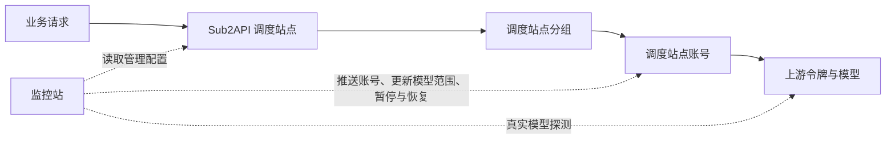

# 调度站点、上游与监控站的关联关系

更新：2026-09-22。本文是关联关系速查；全部功能、条件和现有限制见 [当前项目全部功能与运行逻辑](project-functional-logic.zh-CN.md)。

## 1. 系统现在围绕什么运行

监控站接入 Sub2API 调度站点，以及提供模型服务的上游站点。旧的 NewAPI 主站管理、系统定价、分组编辑和主站日志已移除，接入和选线不再要求配置主站。可选的 NewAPI 用户网关只探测终端用户实际调用的入口，不参与选线，也不读取或修改分组定价。

第三方上游仍然支持 NewAPI 和 Sub2API。NewAPI 作为上游供应商时，通过普通账户的系统访问令牌读取余额、可用分组和 API 令牌；这与被移除的主站管理功能不同。



实线表示业务调用关系，虚线表示监控与控制能力。本站关联用于解释健康状态；开启自动推送后，可创建或复用调度账号，更新可用模型范围、名称和调度开关。业务请求仍由 Sub2API 处理，尚无按延迟/成本动态调整优先级的最优线路算法。

## 2. 各方分别负责什么

| 对象 | 责任 | 接入凭据 |
| --- | --- | --- |
| Sub2API 调度站点 | 保存分组与账号，实际处理模型请求并选择账号 | 监控站使用调度站点 Admin API Key 读取和调用管理接口 |
| 上游供应商 | 提供模型、线路、API 令牌与账户余额 | Sub2API 用户登录授权；NewAPI 用户系统访问令牌 |
| NewAPI 用户网关 | 可选。核对终端入口并单独探测，不参与调度选线和定价编辑 | 该站点的管理员访问令牌 |
| 监控站 | 同步目录、探测模型、展示成本和关联、推送已验证模型并管理异常恢复 | 监控站自身登录会话 |

调度站点 Admin API Key、上游账户授权、上游模型调用 Key、用户网关管理员令牌是不同凭据，不能混用。账户授权用于查询上游资料，真正的探测请求使用对应上游 API Key。

## 3. 关联的准确单位

```text
调度站点 ID
  → 调度站点分组 ID
    → 调度站点账号 ID
      → 上游站点 ID + API 令牌 ID
        → 调度站点模型名 → 上游模型名 + 协议
```

分组与账号归属从调度站点管理接口读取。同步调度站点时，监控站会读取 API Key 账号的 URL 和 Key，在服务器内与上游令牌匹配；只有 URL 与完整 Key 都一致且唯一时，才显示“已自动关联”。忽略末尾斜杠与标准 `/v1` 后缀，保留协议、端口和其他路径差异，不凭名称或域名猜测令牌。

上游同时支持 NewAPI 和 Sub2API。NewAPI 通过用户系统访问令牌读取模型调用令牌；匹配使用模型调用 Key，不使用系统访问令牌。按 NewAPI 网关规则兼容模型 Key 可选的 `sk-` 前缀。上游连接地址先按探针实际使用的基础地址规范化；Sub2API 的模型 Key 保持完整匹配。

新版 Sub2API 会隐藏账号列表中的 Key，此时使用当前管理员权限按账号 ID 读取凭据导出接口，不导出代理。权限不足、Key 不完整、存在重复令牌记录时，页面显示具体原因，保留手动关联入口。调度站点账号的 Key 只在同步过程中参与计算；本地加密快照保存其指纹，浏览器不会收到 Key 或指纹。

自动关联按照调度站点配置的精确模型映射及已发现模型的通配规则对应上游模型；未设置模型映射时，使用该令牌的模型目录。无法确认的映射不会被当作可用模型。上游令牌目录更新后，关联视图随之更新，不额外运行模型请求。

已有手动关联优先保留。手动解除关联会关闭该账号的自动匹配，可在关联窗口点击“恢复自动关联”。自动匹配依据和关闭状态随加密快照保留，重启后仍有效。

例如，一个调度站点 Codex 分组包含账号 A 和账号 B。账号 A 绑定上游甲的令牌 101，账号 B 绑定上游甲的令牌 102。即使它们都支持 `gpt-5`，也分别保存探测和健康状态。令牌 101 失败不会把令牌 102 的成功覆盖掉。

同一个上游令牌可以被多个调度站点账号使用。分组详情会同时显示通过账号数与独立通过令牌数，避免把同一把 Key 当作多条独立备用线路。

## 4. 当前各页面怎么用

| 页面 | 用途 |
| --- | --- |
| 总览 | 管理上游连接、授权、余额、充值倍率；查看各渠道探测状态 |
| 调度站点 | 使用管理员身份连接 Sub2API，同步全站分组和账号 |
| 线路管理 → 分组状态 | 查看调度站点分组的模型通过情况、账号覆盖情况，展开查看具体账号与令牌 |
| 线路管理 → 账号关联 | 将调度站点账号关联到具体上游令牌及模型映射，处理配置变化与失效关联 |
| 线路管理 → 智能选线 | 遍历上游可访问的全部分组，包括尚无令牌的分组，识别类型、等级、成本和利润 |
| 线路管理 → 自动调度 | 从本站来源推送调度账号，更新可用模型、暂停及恢复，查看自动处理记录 |
| 探针监控 → 模型状态 | 按模型类别、模型名查看各令牌的分钟时间轴及失败原因 |
| 探针监控 → 令牌管理 | 查看令牌支持模型，按条件批量启停探测 |

建议先同步上游令牌与调度站点，启用需要的令牌探测；在自动调度中核对目标分组并开启推送，再从分组状态查看可用线路。既有账号的匹配问题可在账号关联中检查，不从调度站反向导入上游。

## 5. “可用”是如何判定的

分组里至少有一个账号对应的模型同时满足以下条件，才计为该模型有通过线路：

1. 调度站点配置最近 24 小时内同步成功，关联对象仍存在且配置没有发生待确认的变化。
2. 分组启用，账号处于 active 状态且允许调度。
3. 对应令牌启用了探测，Key 有效，没有余额不足、模型目录错误或令牌失效等阻塞。
4. 该模型最近 120 秒内真实探测成功，没有等待重新验证或被明确排除。

未关联账号、过期快照、未开启探测、待验证结果均不等于“模型失败”，也不会被伪装为通过。页面会保留对应原因。

当前探测是监控服务器直连上游。因此“有可用线路”表示具备有效关联、且直测成功的候选。调度站点所在网络、协议适配或实际账号配置仍可能影响业务调用，不能把它当作完整业务路径的成功保证。

## 6. 选线与倍率比较

选线直接读取目标调度站点分组倍率，无需填写参考售价或利润百分比，也不读取 NewAPI 主站价格。

```text
折算成本倍率 = 上游适用倍率 × max(1, 高峰因子) ÷ 充值倍率
入选条件：折算成本倍率 < 调度站分组倍率
```

例如上游适用倍率 0.98×、充值倍率 2×、无高峰加价，成本为 0.49×。调度分组倍率为 0.5× 时即可入选，不要求达到某个利润百分比。相等或更高时不入选；倍率缺失时等待确认。

上述估算要求双方使用相同模型基础定价。手续费、长上下文阶梯、独立按次计费和订阅套餐不能简单等同于普通倍率。智能选线的信息不足线路会标记为待确认，不自动创建令牌。自动推送的成本门槛主要约束新建账号，当前不会仅因已接管账号后续涨价而自动停调；选线与推送的检查范围也并不完全一致。

选线会识别 Claude Code、Codex、Grok 等类别，并参考 Kiro、Max、Pro、Plus 等等级。名称匹配只形成候选，不表示探测已通过。

勾选“自动补齐缺失令牌”后，系统只为匹配、成本已知且折算成本倍率低于调度分组倍率的线路创建令牌。已有令牌优先复用。创建前保存意图、创建后回读确认；遇到不确定结果不会盲目重复创建。新增令牌探测默认关闭。

## 7. 统计与刷新

- 总览保留各渠道的探测状态与成功率，不再显示顶部整体指标卡片；详细模型、令牌记录在“探针监控”查看。
- 成功率 = 成功次数 ÷（成功次数 + 失败次数）。待确认结果单独显示，不计入分母。
- 总览复用渠道接口的探针汇总，每 30 秒刷新页面数据，不额外发起付费模型请求。
- 线路管理每 15 秒读取监控站保存的状态；这不等于每 15 秒同步远程调度站点。
- 调度站点配置可通过“同步调度站点”更新；运行智能选线时也会同步目标调度站点。
- 已启用且符合执行条件的普通模型每分钟探测。明确不支持的模型隔离；自动推送为相应令牌开启自动模型恢复后，连续三次失败也会隔离，通常每五分钟复测。普通未开启自动恢复的隔离模型保留手动重新验证入口。
- 单模型失败通常只移除该模型；系统暂停整线后，至少一个保留模型需连续两轮成功才能恢复。余额提醒阈值与实际停调条件不同。
- 上游分组和 Key 的初始发现及异常重试会自动执行；正常目录的全量刷新当前主要通过手动同步或智能选线触发，不等同于余额的五分钟检查。

## 8. 存储与升级

| 文件 | 内容 |
| --- | --- |
| `monitor.sqlite` | 上游与调度配置、授权、快照、关联、接管状态、设置和增量探测历史 |
| `storage.key` | 加密数据密钥，需与数据文件一起备份 |
| `console-sessions.json` | 监控站登录会话的哈希标识 |
| 旧 `*.enc.json` | 首次迁移前的历史文件，不再作为日常业务存储 |

生产数据目录为 `/var/lib/signal-monitor`。业务数据使用 SQLite，配置和历史正文加密，索引字段保留用于查询；服务内存保存当前运行状态。浏览器 IndexedDB 仅是脱敏展示缓存。选线任务结果当前保存在服务进程内；重启后可重新扫描。详细规则见 [存储与规模说明](storage-scaling.zh-CN.md)。

旧版主站存储文件和旧分组关联字段不再加载到主站模块，也不再影响任何关联或选线判断。升级不主动销毁历史文件，方便回滚；不会读取旧主站凭据或请求原主站接口。远程站点本身的业务配置不受此次删除影响。

发布包仅包含代码和构建产物，不携带本地业务数据。升级会校验调度站点、上游身份、账号关联及存储密钥保持一致。
