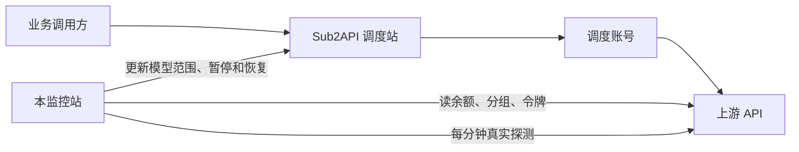

# 功能介绍

整理日期：2026-09-23。依据当前侧栏、页面文案和 `server/` 实现，不是开发计划。线上渠道数量、余额和线路状态会变化，本文不记录某一次的实时数字。

更细的实现核对仍见 [当前项目全部功能与运行逻辑](project-functional-logic.zh-CN.md)。两边不一致时，以本文和当前页面为准。

## 1. 这个站是做什么的

这是一个上游账户监控和调度控制台。它不转发用户请求。

用户实际调用的是我们自己的 Sub2API 调度站。本站做三件事：

1. 登录已接入的上游账户，读取余额、分组、倍率和已有 API 令牌。
2. 用这些令牌对每个模型发真实探测，确认现在能不能用。
3. 把探测通过、成本不高于目标分组的线路写到调度站；故障时缩小模型范围或暂停整条线路，恢复后再打开。



监控服务停掉以后，调度站仍按上次保存的配置转发。此期间本站不能再停掉新出现的故障，也不能自动恢复。

## 2. 先分清这些对象

这些词在页面上经常同时出现，数量并不相等。

| 对象 | 是什么 | 在哪里管理 |
| --- | --- | --- |
| 上游渠道 | 一个上游账户连接，含地址、授权和充值倍率 | 总览 |
| 上游分组 | 这个账户能选的一种计费组或线路 | 总览里的渠道详情 |
| 上游令牌 | 上游账户里用来调用模型的 API Key | 探针监控 → 令牌管理 |
| 模型探测 | 某一把 Key 对某一个模型的一次真实调用 | 探针监控 → 模型状态 |
| 调度站点 | 我们有管理员权限的 Sub2API | 调度站点 |
| 调度分组 | 调度站对外出售或提供的分组，含平台和倍率 | 线路管理 → 分组状态 |
| 调度账号 | 调度站用来访问上游的账号，自动调度主要维护 API Key 类型 | 线路管理 → 自动调度 |
| 推送线路 | 一把上游令牌在某一个模型系列、某一种协议下的调度单元 | 自动调度列表中的一行 |

同一把令牌如果同时有 OpenAI 和 Anthropic 接口，可以变成多条推送线路。同名渠道、同名令牌、相同地址都不会合并成一条探测结果。

线路显示名是 `站点名称 · 实际倍率`，例如 `示例站点 · 0.12×`。实际倍率是该令牌所用分组的倍率，再除以本站填写的充值倍率。倍率缺失时显示「倍率未知」。这个名字只用于本站和已接管的调度账号，不会改上游原来的 Key 名称。

## 3. 四套凭据不能混用

| 凭据 | 能做什么 | 不能拿来做什么 |
| --- | --- | --- |
| 本站登录账号和密码 | 打开这个控制台 | 不能登录上游，也不能调用模型 |
| NewAPI 系统访问令牌，以及必要时的用户 ID | 读取该上游账户、余额、分组和令牌 | 不是模型调用 Key，也不是上游管理员密钥 |
| Sub2API 上游的邮箱、密码、按需的两步验证码 | 以普通用户身份登录该上游 | 本站不保存密码和验证码，只保存登录后的令牌 |
| 调度站 Admin API Key | 读取并修改我们自己的调度站账号 | 只能发给这个调度站的管理接口 |

探测使用同步下来的模型调用 Key。余额能查到，不代表模型调用成功；模型调用成功，也不代表账户余额充足。

Sub2API 上游登录后会按上游规则自动续期。上游取消授权、封禁账户或刷新令牌失效时，必须在总览里重新授权。人机验证凭证只交给上游校验这一次，不保存，也不能由本站生成。

编辑渠道时，类型和地址保持不变，避免把旧令牌和历史记到另一个站点。凭据留空表示保留现有授权。这里填写的新密码只是重新登录，不会修改上游账户的密码。

## 4. 侧栏每个页面做什么

桌面用左侧导航，手机用底部导航和展开菜单。页面位置记在网址的 `#` 后面，刷新不会回到总览。

### 4.1 总览

管理上游渠道，不管理调度站。

可以做：

- 添加 NewAPI 或 Sub2API 上游。
- 编辑名称、充值倍率，或重新授权。
- 查看登录是否有效、折算余额、探测成功率和已启用令牌数。
- 打开渠道详情，查看这个账户的分组和令牌。
- 兑换码，或按上游支持的方式创建充值订单。
- 点「查看探针」，只看这个渠道的模型状态。

添加渠道时的「自动探测新令牌」表示：同步上游已经存在的令牌并开始探测。它不会在上游创建新令牌。手动停用过的令牌保持关闭。

列表大约每 30 秒读取本站已有结果，不会因此重置当前页。可以按添加时间、名称、折算余额、成功率、异常优先和最近探测排序。搜索和筛选先作用于全部渠道，再分页，每页 5 条。

总览上的成功率是探针成功率：成功次数除以成功加失败的次数。响应没确认、以及这一分钟没有探测的记录，不进入这个计算。它不是用户真实请求的成功率。

### 4.2 调度站点

接入我们自己的 Sub2API，使用管理员 Key。

这里同步全站分组和账号，查看分组倍率、高峰规则和账号归属。分组必须先在 Sub2API 后台建好。本站只读取分组，不创建、不删除、也不代替 Sub2API 的完整管理后台。

新建调度站点时可以勾选「自动推送稳定线路」。已有站点是否推送，在线路管理里用总开关控制。

### 4.3 线路管理

这是日常看线路的地方。先在右上角选择调度站点。页面里有两个常用视图，另有两个只在排查时使用的入口。

#### 自动调度

主流程是：自动接入，探测验证，达标线路进入调度，异常后再恢复。

总开关叫「自动推送」。

- 打开后，成本不高于目标分组、并且探测正常的线路都会参与调度。同一个模型可以由多条线路同时承接，没有主用和备用之分。
- 关闭后，本站停止继续改调度站。已经写到远端的配置会保留，不会立刻把远端线路关掉。
- 要让某一把令牌退出调度，应到探针监控关闭这把令牌的探测。后台随后会暂停对应账号。

每一行还有这些状态和处理：

| 状态或开关 | 作用 |
| --- | --- |
| 正常调度 | 远端账号正在按当前模型范围承接 |
| 等待验证 / 等待探针 | 还没有足够的成功探测，先不放行 |
| 短暂异常观察 | 原来成功过的模型出现暂时失败，短时间仍保留 |
| 已隔离 | 该模型或线路已从可用范围拿掉 |
| 恢复验证 | 暂停之后正在等待连续成功 |
| 人工暂停 | 这条线路不再被探测结果自动打开，需要点「恢复自动」 |
| 影子模式 | 只在本站计算，不写入调度站。默认关闭 |
| 紧急冻结 | 立刻停止自动写入。默认关闭 |
| 写入审批 | 每轮写入调度站前需要手动批准。默认关闭 |
| 只改本站账号 | 不修改不是本站创建的调度账号。默认关闭 |
| 保持优先级 / 价格优先 / 速度优先 | 默认不改调度站原有优先级。后两种从 101 起排序，数字越小越先被调度；速度相差不到 50 毫秒时不互换 |

目标分组有多个候选、凭据失效或远端写入没有确认时，这一行会给出原因。具体修改记录在日志中心。

#### 分组状态

按调度分组查看现在有哪些模型、关联了哪些账号、哪条线路可用，以及不可用的原因。这里只展示和筛选，不改上游，也不改调度开关。

#### 高级维护

默认收起。自动匹配已经会建立关联，正常接入不必进入这里。

- **账号关联**：核对旧调度账号和上游令牌是否对应，必要时手动关联、确认模型映射或解除错误关联。
- **智能选线**：按分组名称、平台和倍率比较已有线路。它只识别，不创建令牌。某个分组在上游还没有令牌时，要先到上游或探针监控里创建，再同步。

### 4.4 探针监控

分两个标签。

#### 模型状态

按模型系列查看每一把令牌的当前结果。同一个模型的不同令牌分开显示，不会合成一条时间轴。

- 每个格子是一分钟，展示最近 60 个已经结束的分钟。空格表示这一分钟没有记录，不算成功，也不算失败。
- 点格子可以看 HTTP 状态、失败原因和完整响应耗时。这不是首字延迟，也不是百分位统计。
- 可以搜索模型、上游、令牌、分组或地址，并按可用、异常等状态筛选。
- 可以启用、停止或重新验证。批量操作覆盖当前筛选出的全部令牌，不受当前页只有 5 条的限制。
- 从总览进来时只看该渠道；「查看全部站点」才清除这个条件。

探测结果超过大约 120 秒没有更新，会被标成过期。成本过高时显示暂停，不会把以前的绿色记录当成当前可用。

#### 令牌管理

按上游地址列出已同步的令牌，展示模型目录，并可以：

- 同步令牌。进入某一个渠道的视图后，批量启停只作用于当前显示结果；「同步全部令牌」仍会同步所有上游。
- 启用或停止这把令牌的全部模型探测。停止会保留历史。
- 创建上游令牌。可指定分组；留空则跟随账户分组。创建后自动同步到列表，页面不显示令牌明文。
- 删除上游令牌。已经关联调度线路时会拒绝删除，避免把正在使用的 Key 删掉。

### 4.5 日志中心

记录本站自己的业务操作和探测明细。

操作记录包括：自动调度开关、推送、暂停和恢复、远端写入是否确认、模型名单修改前后、同步、授权、充值兑换、人工启停探针、选线，以及服务启停。模型探测记录来自现有探测历史，打开日志不会额外再测一次。

可以按时间、类型、结果、调度站点、上游渠道和关键词筛选。首页大约每 15 秒更新；打开详情、翻页或浏览器切到后台时暂停更新。

日志不保存密码、模型 Key、访问令牌、兑换码和支付链接。它也不是 Nginx 访问日志，更不是用户在调度站上的完整请求日志。

### 4.6 QQ 机器人

只把告警发到一个 QQ 群，不在群里回答问题，也不接收命令。

使用前需要：

1. 在页面保存 AppID 和 AppSecret，并启用告警。AppSecret 只留在服务器上，保存后不再显示。
2. 把页面上的回调地址填到 QQ 开放平台。
3. 把机器人拉进目标群，或在群里 @ 它一次。本站靠这个事件记下告警群。
4. 可以用「发送测试」确认能发出去。

只发纯文本，并且同一件事恢复之前不重复发：

- 折算余额不高于设置页的提醒阈值。
- 分组倍率发生变化，或分组新增、删除。同一轮扫描合并成一条；小于设置的百分比不发。第一次同步只建立基线。
- 上游出现新公告。NewAPI 读取公开的状态公告和通知，Sub2API 读取当前账号可见公告。第一次同步不补发旧公告。渠道详情里可以让某个渠道不再推送公告。
- Sub2API 订阅的日、周、月剩余百分比不高于设置，或订阅进入到期提醒天数。钱包余额不变。
- 整条线路因为余额耗尽、成本过高或故障被系统暂停。普通等待、人工暂停和观察期不发这条。
- 同一个上游里，至少两个受监测模型全部失败。

### 4.7 设置

设置页可以改这些提醒，默认值是：低余额 5 美元、倍率变化 1%、订阅日/周/月剩余 20%、订阅到期 3 天。低余额同时影响页面顶部提醒和 QQ。其余几项只影响 QQ 和渠道详情里的记录。

这个阈值不是停调度的阈值。余额是 4 美元、阈值是 5 美元时，只会提醒；只有余额查询成功且不大于 0，或者令牌额度确认耗尽，才会暂停调度。

探针间隔、隔离次数、调度检查频率都不能在设置页修改，它们写在程序里。

页面顶部的余额公告展示低于阈值的渠道，以及余额暂时无法确认的渠道。查询失败会保留上次金额并标成待确认，不会把失败显示成 0。从公告可以进入充值与兑换。

## 5. 余额、倍率和充值

```text
实际余额 = 上游返回的余额 ÷ 本站填写的充值倍率
折算成本倍率 = 上游适用倍率 × 高峰因子 ÷ 充值倍率
```

高峰因子至少按 1 计算。折算成本不高于调度分组的基础倍率时，这条线路才允许进入调度；等于目标倍率也允许。没有最低利润率，也不按每个模型的输入、输出、缓存和阶梯价格计算真实利润。

充值倍率只影响本站的成本比较和余额展示，不修改上游钱包，也不改变支付页面上的付款金额。

余额大约每 5 分钟检查一次。Sub2API 需要续期时可能提前。分组同步大约每 5 分钟顺带读取倍率变化、上游公告和 Sub2API 订阅用量。总览每 30 秒只是重新读取本站已经保存的结果，不会每次都请求上游。

订阅用量只展示和告警，不折进钱包余额，也不单独作为暂停调度的条件。钱包仍然按原来的余额规则处理。

充值与兑换：

- 兑换码提交给上游。Sub2API 走兑换接口，NewAPI 走充值接口。本站保存操作结果和兑换码指纹，不保存兑换码原文。超时只表示结果未知，不会自动再兑一次。
- 在线充值先向上游询价，用户确认后创建订单，然后到上游的收银台或二维码付款。创建订单不等于到账。本站不代收、不自动支付。
- 上游没有可用的站内支付时，只展示上游明确给出的购买或充值地址，不猜测卡密网站。
- 付款链接和未到账的订单不会直接恢复调度。要等余额重新查到正数，并且探测重新通过。

## 6. 探测怎么判断可用

执行单位是「渠道 + 令牌 + 模型」。不是一个站点每分钟随机抽一个模型。

已启用、凭据有效、余额和成本都没有挡住的普通模型，每分钟测一次。后台大约每秒看有没有到期任务，但不会每秒都调用模型。单次请求大约 45 秒超时，超时后这一轮不额外重试。

模型目录成功后大约 10 分钟刷新一次，失败时大约 1 分钟后再试。目录刷新和令牌列表同步不是同一件事。

一次探测可能是成功、明确失败，或响应未确认。空内容、只剩推理过程、达到本次很小的输出上限，都不算可用成功。网络超时、限流和认证错误会留下原因；上游明确表示模型不存在时，该模型会被隔离。

已经由自动调度接管、并开启了自动恢复的令牌：

- 同一个模型连续 3 次明确失败后隔离，之后大约每 5 分钟再测一次。
- 测成功后重新放回可用范围。
- 没有这个自动恢复标记的普通令牌，隔离后需要在探针页手动点重新验证。

探针页面把连续失败达到 5 次的记录归到持续异常，这只是展示分类，和上面的 3 次隔离不是同一个规则。

## 7. 自动调度怎样停、怎样开

后台大约每 5 秒检查一次。调度站开启自动推送后，远端配置大约超过 60 秒会重新同步。失败后大约 60 秒再试。写入必须回读确认，超时不算成功。

### 7.1 只去掉坏模型

同一把令牌上 A 失败、B 和 C 近期成功时，只把 A 移出调度账号的模型范围，B 和 C 继续用。A 重新探测成功后再加回去。

最近 120 秒内成功过的模型，如果这一轮只是超时、连接异常、上游暂时异常、限流或响应未确认，可以进入最多约 2 分钟的观察期，暂时保留。认证失败、权限、额度、余额不足、令牌失效、探针关闭和透传线路不适用观察期。观察期从上次成功完成时开始算，失败和重启都不会延长。

### 7.2 暂停整条线路

遇到这些情况会暂停对应调度账号，而不是写一个空模型名单。空名单在 Sub2API 里可能表示允许所有模型，所以本站保留上次名单，并用调度开关禁止使用。

- 钱包查询成功且余额不大于 0，或令牌额度确认耗尽。
- 探测被停止，Key 缺失、过期、停用，或来源不可用。
- 有效模型目录确认是空的。
- 这个平台下没有本轮通过的模型，也没有还能留在观察期里的模型。
- 来源地址、Key 或分组身份变了，旧的接管目标对不上。
- 远端开了透传，一个失败模型无法单独隔离，于是暂停整条。

QQ 只会通知其中由系统因余额、成本或故障执行的暂停。

### 7.3 恢复

系统暂停的线路要同时满足：

1. 来源、Key 和探测开关恢复有效。
2. 不再处于已经确认的余额阻断。
3. 至少一个模型在这次暂停之后连续两轮探测成功。不要求所有模型一起恢复。
4. 账号没有仍在生效的到期、限流或其他冷却。
5. 远端地址、Key、平台和目标分组仍与本站来源一致。

单个模型重新加入一条仍开着的线路，通常只需要一次新的有效成功。整条账号从系统暂停里恢复，才需要连续两轮。

人工暂停不会被探测结果自动解开。URL、Key、平台或目标分组不匹配时，本站不会覆盖远端，只会显示原因并稍后重试。

## 8. 一条新线路怎么接

1. 在「调度站点」添加我们的 Sub2API，确认目标分组和倍率已经存在。新站点默认可以开启自动推送。
2. 在「总览」添加上游，完成授权，填写充值倍率。一般保持「自动探测新令牌」打开。
3. 等待后台同步余额、分组和已有令牌，并开始按分钟探测。上游某个分组如果还没有令牌，本站不会自动创建，需要手动创建后再同步。
4. 探测通过且成本不高于目标分组后，自动调度复用或创建调度账号，并维护模型范围。不需要先去手动关联。
5. 在「自动调度」看每条线路的状态，在「分组状态」看某个分组实际能用哪些模型。
6. 日常只处理余额提醒、授权失效，以及目标分组不唯一这类需要人确认的行。

## 9. 常用时间

| 事项 | 当前规则 |
| --- | --- |
| 普通模型探测 | 每分钟一次 |
| 单次探测超时 | 约 45 秒，不额外重试 |
| 成功结果能用来调度的时间 | 约 120 秒 |
| 短暂异常观察 | 从上次成功起最多约 2 分钟 |
| 已隔离模型复测 | 约 5 分钟，且需要自动恢复已开启 |
| 整条线路恢复 | 暂停后至少一个模型连续两轮成功 |
| 余额、分组和令牌同步 | 正常约 5 分钟，失败至少隔 1 分钟 |
| 余额超过 15 分钟没更新 | 公告标成待确认 |
| 模型目录刷新 | 成功约 10 分钟，失败约 1 分钟 |
| 自动调度检查 | 约 5 秒 |
| 调度站配置重新同步 | 快照大约超过 60 秒时 |
| 总览和余额公告刷新 | 约 30 秒，只读本站快照 |
| 探针页刷新 | 约 5 秒；浏览器隐藏时暂停 |
| 日志首页刷新 | 约 15 秒 |
| 每个模型保留的探测历史 | 最近 1,440 条 |
| 普通登录有效期 | 12 小时；勾选记住登录为 7 天 |

## 10. 数据放在哪里

生产数据在服务器的 `/var/lib/signal-monitor/monitor.sqlite`。渠道配置、授权、调度关联、探测历史和操作日志都在这里，敏感内容加密。登录会话另外保存。

程序内存里只放当前运行需要的最近结果，不是全部历史。浏览器里的缓存只为了加快页面显示，刷新或换浏览器不会变成另一份业务数据。

同一份数据只由一个监控进程使用。不要同时启动第二个进程，也不要用旧的 PM2 或 `vite preview` 发布。

## 11. 现在没有这些能力

- 不转发、不代理用户请求，也不读取调度站的用户请求日志来计算成功率。
- 不把 NewAPI 当作本站的主站来管理。NewAPI 只作为上游账户接入。
- 不自动创建上游缺失令牌，不自动删除失败的调度账号。
- 不自动付款，不代收款，也没有每天固定金额的预算上限。
- 不按模型的完整单价、缓存价格和阶梯价格核算利润。
- 不做多管理员、多工作区和权限分级。
- 侧栏没有「用户网关」页面。相关接口仍留在服务端，不作为当前操作入口。
- 不发送邮件、短信，除 QQ 机器人外也没有别的告警通道。
